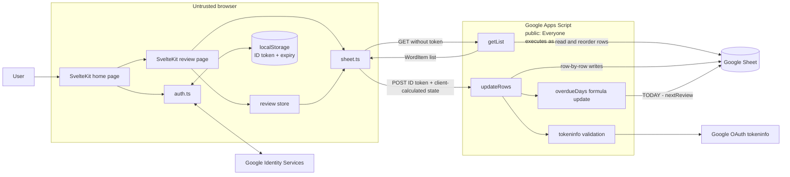

# Current-State Auth, Vocabulary, and Review Flow Trace

- Date: 2026-08-28
- Training ticket: [#4](https://github.com/JosephT5566/english-learning/issues/4)
- Scope: document the existing SvelteKit -> Google Identity Services -> Google Apps Script -> Google Sheets behavior before changing the persistence boundary
- Non-goals: change authentication, fix scheduling or sorting, add FastAPI, or redesign the Sheet

## Evidence and confidence

This report separates three evidence sources:

- **Repository evidence:** inspected frontend source and locally executed commands.
- **Apps Script evidence:** behavior and selected code excerpts inspected and described by the project owner during the training session. The Apps Script source is not stored in this repository.
- **Runtime evidence:** local frontend startup and an unauthenticated Apps Script request attempted on the dates recorded below.

Unknown behavior is labeled rather than inferred. No endpoint URL, token, email address, spreadsheet ID, or private vocabulary row is included.

## Reproducible local baseline

From the repository root:

```bash
npm install
npm run dev -- --host 127.0.0.1
npm run check
npm run lint
npm run build
```

`npm install` is the documented dependency-install command; it was not rerun during this trace because dependencies were already present.

### Actual results

| Date       | Command                           | Result                                                                                                                                                                                                                                                                     |
| ---------- | --------------------------------- | -------------------------------------------------------------------------------------------------------------------------------------------------------------------------------------------------------------------------------------------------------------------------- |
| 2026-08-28 | `npm run dev -- --host 127.0.0.1` | Vite started on `127.0.0.1:5173`; an HTTP request to `/` returned `200 text/html`. Startup warned that `src/routes/review/page.ts` is missing the SvelteKit `+` route prefix. The server was then stopped normally.                                                        |
| 2026-08-26 | `npm run check`                   | Failed: 6 errors and 6 warnings. Errors were the missing `FrontFace.tags` property and nested-array-to-`string[]` conversions in `SwipeCards.svelte`. Warnings included accessibility labels, non-reactive `cardsWrap`, unused layout CSS, and the route filename warning. |
| 2026-08-26 | `npm run lint`                    | Failed: Prettier reported style differences in 21 files, so ESLint did not run.                                                                                                                                                                                            |
| 2026-08-26 | `npm run build`                   | Passed and wrote the static site to `build/`. The build still emitted the route filename, unused CSS, accessibility, and non-reactive-state warnings.                                                                                                                      |

A successful production build does not imply that type checking or linting passed.

The existing user workflow had already been marked as locally demonstrable in the ticket. This documentation session verified the local server and home-page response but did not repeat a complete signed-in review and Sheet update.

## Current-state architecture



The browser is not a trusted authorization or data-integrity boundary. Apps Script is the current server boundary and uses the script owner's authority to access the Sheet.

## Flow 1: Google sign-in and token lifecycle

### Trace

1. `src/routes/+layout.ts` runs in the browser, reads the locally stored token and expiry through `getIsSignedIn()`, restores the Svelte auth store when the local expiry check passes, and redirects non-home routes to `/` otherwise.
2. `src/routes/+page.svelte` runs its `onMount()` handler. When the auth store is false, it calls `initGsiOnce()` and `renderGoogleButton()` from `src/lib/auth.ts`.
3. `src/app.html` loads the Google Identity Services client. `initGsiOnce()` configures the public client ID and browser-visible email allowlist.
4. Google Identity Services returns a credential to the callback after the user completes Google's flow.
5. The browser decodes the JWT payload and checks `email`, `email_verified`, allowlist membership, and `exp`. It does not cryptographically verify the signature and does not check `aud` or `iss` here.
6. The browser stores the raw ID token as `gid_id_token` and its expiration as `gid_exp`, then sets the Svelte `isSignedIn` store to true.
7. `getTokenIfValid()` and `getIsSignedIn()` treat the token as expired when fewer than 120 seconds remain: a 60-second safety buffer plus a 60-second clock-skew allowance.
8. Review submission reads the stored token. Apps Script sends it to Google's `tokeninfo` endpoint and checks `aud`, `iss`, `exp`, and an email allowlist before processing the update.

### Contract and boundaries

| Item                         | Current behavior                                                                                                                                                                |
| ---------------------------- | ------------------------------------------------------------------------------------------------------------------------------------------------------------------------------- |
| Frontend entry point         | `src/routes/+page.svelte` `onMount()` and the Google-rendered button; `src/routes/+layout.ts` restores local state and redirects routes                                         |
| Frontend helper              | `src/lib/auth.ts`                                                                                                                                                               |
| External boundary            | Browser <-> Google Identity Services                                                                                                                                            |
| Browser storage              | Raw Google ID token and expiration in `localStorage`                                                                                                                            |
| Server verification boundary | Apps Script -> Google OAuth `tokeninfo` during review updates                                                                                                                   |
| Data returned                | Google credential/ID token; decoded profile claims are available in the browser                                                                                                 |
| Visible failure              | Missing or expired local token redirects protected routes home. Credential callback failures are logged with `console.error`; there is no custom user-facing auth error dialog. |

### Trust assumptions and weaknesses

- Decoding a browser-held JWT does not prove that Google issued it.
- The browser-visible email allowlist and Svelte auth store are UI controls, not authorization controls.
- Apps Script performs stronger token checks for review updates, but no observed per-row ownership model exists.
- `signOut()` clears storage but does not reset the `isSignedIn` store, so the current UI may remain signed in until state is reloaded.

## Flow 2: vocabulary retrieval

### Trace

1. `src/routes/review/+page.svelte` calls `getWordListFromSheet()` during `onMount()`.
2. `src/lib/api/sheet.ts` sends `GET PUBLIC_APP_SCRIPT_URL?action=getList&count=10` without an ID token.
3. Apps Script opens the first Sheet using `SpreadsheetApp.openById(...).getSheets()[0]` and retrieves all rows. No `status`, due-date, nonempty-ID, or owner filter runs before sorting.
4. Apps Script performs three sequential in-place Sheet sorts, retains the first 30 candidates, and randomly selects 10.
5. The frontend expects `{ "ok": true, "result": WordItem[] }`. It shuffles the result again and stores it in the Svelte `wordList` store.
6. `SwipeCards.svelte` renders the cards. An empty array displays the no-cards message.

### Observed sort defect

`HEADER_MAP` uses zero-based indexes for JavaScript arrays, while `Sheet.sort()` expects one-based Sheet column positions.

| Intended field           | Apps Script call                                                         | Actual Sheet field                  |
| ------------------------ | ------------------------------------------------------------------------ | ----------------------------------- |
| `lastReview` ascending   | `sh.sort(HEADER_MAP.lastReview, true)` where the map value is `17`       | Column 17: `intervalDays` ascending |
| `reviewStage` ascending  | `sh.sort(HEADER_MAP.reviewStage, true)` where the map value is `14`      | Column 14: `status` ascending       |
| `overdueDays` descending | `sh.sort(HEADER_MAP.overdueDays + 1, false)` where the map value is `20` | Column 21: `overdueDays` descending |

The calls are sequential, so `overdueDays` is the final primary sort. Preservation of earlier ordering among ties is not explicitly guaranteed. Blank-value ordering was not verified.

### Contract and boundaries

| Item                   | Current behavior                                                                                                                                                                                                             |
| ---------------------- | ---------------------------------------------------------------------------------------------------------------------------------------------------------------------------------------------------------------------------- |
| Frontend entry point   | `src/routes/review/+page.svelte` `onMount()`                                                                                                                                                                                 |
| Frontend helper        | `src/lib/api/sheet.ts#getWordListFromSheet`                                                                                                                                                                                  |
| Request                | `GET ?action=getList&count=10`; no application credential                                                                                                                                                                    |
| External boundary      | Browser -> public Apps Script web app                                                                                                                                                                                        |
| Apps Script authority  | Deployment access is `Everyone`; execution identity is the script owner                                                                                                                                                      |
| Returned data          | Up to 10 Sheet-backed vocabulary records using the `WordItem` shape                                                                                                                                                          |
| Persistent side effect | `getList` reorders Sheet rows through `sh.sort()` despite using GET                                                                                                                                                          |
| Visible failure        | The page initially shows `Loading...`. Network errors, invalid JSON, or `{ "ok": false }` reject the unhandled `onMount()` promise and leave the loading UI in place. An empty successful result shows the no-cards message. |

### Runtime observation

An unauthenticated request was attempted from a clean command-line HTTP client. One attempt returned no usable output; a bounded retry timed out after 20 seconds without an HTTP response. This did not prove response accessibility, but the deployment configuration independently confirms `Everyone` access and the request carries no application token. Because the GET handler sorts the Sheet, an aborted client request may still finish and mutate row order server-side.

### Trust assumptions and weaknesses

- Anyone with the public endpoint can invoke `getList` using the script owner's Sheet authority.
- The public endpoint URL is shipped through a `PUBLIC_` browser environment variable and must not be treated as a secret.
- Retrieval exposes learning content and review metadata without application authentication.
- An unauthenticated read request can also mutate row order and consume Apps Script capacity.
- Retrieval does not enforce ownership or card eligibility.

## Flow 3: review calculation and Sheet update

### Trace

1. `src/lib/components/SwipeCards.svelte` requires the top card to be flipped before swipe or action-button input is accepted.
2. A completed card supplies a quality value and remembered/forgotten decision to `updateFinishedCardToStore()`.
3. The frontend clamps the next stage to 1-5 and calls `setNewField()` in `src/lib/stores/review.ts`.
4. `setNewField()` uses the browser clock, calculates an interval with `STAGE_INTERVALS`, and records `reviewStage`, `easeFactor`, `lastReview`, and `nextReview` in the pending `newFields` store. It calculates `newIntervalDays` but does not include `intervalDays` in the update payload.
5. After all cards are processed, `SwipeCards.svelte` shows `Submit Results`. `AsyncButton` calls `updateReviewToSheet($newFields)`.
6. `src/lib/api/sheet.ts` rejects the request locally when `getTokenIfValid()` returns null. Otherwise it posts `op`, `id_token`, and the fields keyed by card ID.
7. Apps Script verifies the ID token through Google `tokeninfo`, then reads the complete ID column and loops over every Sheet row.
8. For each matching ID, Apps Script reads the entire row, replaces truthy submitted values for the four recognized fields, and calls `setValues([rowValues])` for that row.
9. After the row loop, Apps Script separately calls `updateOverdueDaysFormula(sh)`, which maintains `overdueDays` as `TODAY() - nextReview`.
10. Apps Script returns `{ "ok": true }` on its success path. It does not return updated counts, missing IDs, per-row outcomes, or resulting review state.

### Request contract

Dates are JavaScript `Date` values in the frontend store and become ISO strings through `JSON.stringify()`.

```json
{
  "op": "updateRows",
  "id_token": "<redacted Google ID token>",
  "fields": {
    "sample-001": {
      "reviewStage": 3,
      "lastReview": "2026-08-28T04:00:00.000Z",
      "nextReview": "2026-09-14T04:00:00.000Z",
      "easeFactor": 2.4
    }
  }
}
```

Successful response:

```json
{ "ok": true }
```

The frontend shared type expects successful `AppScriptResponse<T>` values to contain `result`, so the update success response is narrower than the declared TypeScript contract. Runtime handling succeeds because `isFailure()` checks only `ok`.

### Contract and boundaries

| Item                 | Current behavior                                                                                              |
| -------------------- | ------------------------------------------------------------------------------------------------------------- |
| Frontend entry point | `SwipeCards.svelte` card actions and `Submit Results`                                                         |
| Frontend helpers     | `src/lib/stores/review.ts#setNewField`, then `src/lib/api/sheet.ts#updateReviewToSheet`                       |
| External boundary    | Browser -> Apps Script -> Google OAuth tokeninfo and Google Sheets                                            |
| Submitted data       | Client-selected card IDs and client-calculated stage, ease factor, last-review date, and next-review date     |
| Data written         | The four submitted fields for each matching row; then the `overdueDays` formula                               |
| Visible success      | Button changes to `Submitted` and becomes disabled                                                            |
| Visible failure      | Browser alert with the thrown message and button overlay changes to `Fail`; the user may retry the full batch |

### Trust assumptions and weaknesses

- Authentication establishes an allowlisted caller but does not validate the submitted state transition.
- Apps Script does not enforce card ownership, stage or ease-factor ranges, date validity/order, or uniqueness of IDs in the observed update function.
- Truthiness checks silently ignore zero, empty, or null values; other out-of-range truthy values are written.
- Missing submitted IDs are silently ignored. Duplicate Sheet IDs would update every matching row.
- Each matching row is written separately, then formulas are updated separately. The operation is not atomic and can partially succeed.
- Reading and rewriting an entire row can overwrite a concurrent change unless locking exists elsewhere; no lock was observed in the supplied function.
- The acknowledgement does not let the frontend reconcile partial or missing updates.
- Retrying after an ambiguous failure resubmits the whole batch without an idempotency key.
- `calNewEaseFactor()` is declared as `(quality, currentEaseFactor)` but called as `(currentWord.easeFactor, quality)`; intended scoring compatibility remains unresolved.

## Google Sheet field inventory

The current first Sheet contains these headers in order. No Sheet data-validation, uniqueness, or required-field rules were identified during this inspection.

| Column | Header           | Frontend representation    | Observed constraint or behavior                                                              |
| -----: | ---------------- | -------------------------- | -------------------------------------------------------------------------------------------- |
|      1 | `id`             | Required `string`          | Used as the update lookup key; uniqueness and nonempty values are assumed, not enforced      |
|      2 | `lessonDate`     | Required ISO-like `string` | Parsed for display; validity not enforced at the Sheet boundary                              |
|      3 | `content`        | Required `string`          | Expected term or phrase; nonempty value not enforced                                         |
|      4 | `type`           | Required `string`          | Free-form classification; no enum observed                                                   |
|      5 | `phonics`        | Optional `string`          | No format rule observed                                                                      |
|      6 | `chineseExplain` | Required `string`          | Expected meaning; nonempty value not enforced                                                |
|      7 | `engExplain`     | Optional `string`          | No format rule observed                                                                      |
|      8 | `synonyms`       | Optional `string`          | Comma-separated convention                                                                   |
|      9 | `antonyms`       | Optional `string`          | Comma-separated convention                                                                   |
|     10 | `tags`           | Optional `string`          | Comma-separated convention                                                                   |
|     11 | `note`           | Optional `string`          | Frontend also treats comma-separated values as chips                                         |
|     12 | `supplementary`  | Optional `string`          | Free-form text                                                                               |
|     13 | `example`        | Optional `string`          | Free-form text                                                                               |
|     14 | `status`         | Optional `string`          | No enum observed; `getList` does not filter it                                               |
|     15 | `reviewStage`    | TypeScript union 1-5       | Normal frontend clamps 1-5; Apps Script and Sheet do not enforce the range                   |
|     16 | `easeFactor`     | Required `number`          | Commented expectation 1.3-2.5; no server or Sheet constraint observed                        |
|     17 | `intervalDays`   | Required `number`          | Returned to frontend but not updated by the current review payload; may become stale         |
|     18 | `lastReview`     | Optional ISO-like `string` | Client supplies browser time; Apps Script constructs `Date` without explicit validity checks |
|     19 | `nextReview`     | Optional ISO-like `string` | Client-calculated; no ordering constraint relative to `lastReview`                           |
|     20 | `createdDate`    | Optional ISO-like `string` | No validation observed                                                                       |
|     21 | `overdueDays`    | Missing from `WordItem`    | Apps-Script-maintained formula `TODAY() - nextReview`; Sheet timezone semantics apply        |

The [sanitized representative fixture](fixtures/current-sheet-sample.json) is synthetic and contains no tokens, account identifiers, spreadsheet identifiers, endpoint URLs, or private learning rows.

## Trust boundaries

| Boundary                                | Untrusted data crossing it                     | Required validation                                                       | Current result                                                                    |
| --------------------------------------- | ---------------------------------------------- | ------------------------------------------------------------------------- | --------------------------------------------------------------------------------- |
| User -> browser                         | Card decisions and UI events                   | UI sequencing and input handling                                          | Card must be flipped in the normal UI, but browser code can be bypassed           |
| Google Identity Services -> browser     | ID token claims                                | Signature, issuer, audience, expiry, verified identity                    | Browser decodes selected claims but does not establish a secure identity boundary |
| Browser -> public Apps Script `getList` | Query parameters and anonymous requests        | Authentication, ownership, eligibility, limits                            | No application authentication or owner filter; handler executes as script owner   |
| Browser -> Apps Script `updateRows`     | ID token, card IDs, stages, factors, and dates | Token verification, ownership, command validation, legal state transition | Token claims and email allowlist checked; ownership and state values trusted      |
| Apps Script -> Google Sheet             | Row lookup, row values, formulas               | Schema validation, uniqueness, atomicity, concurrency control             | Flexible Sheet storage, no observed validation rules, row-by-row writes           |

Authentication and authorization are distinct: token verification identifies an allowlisted caller, while ownership enforcement determines whether that caller may read or update a specific card. No current per-row ownership model was observed.

## Failure behavior summary

| Failure                                         | Current visible behavior                                        | State risk                                   |
| ----------------------------------------------- | --------------------------------------------------------------- | -------------------------------------------- |
| GIS library missing                             | Initialization throws; no designed recovery UI                  | Sign-in unavailable                          |
| Google credential rejected by browser checks    | Error logged to console; user remains on sign-in page           | No actionable message                        |
| Stored token missing or near expiry             | Protected route redirects home; update helper throws if invoked | Pending review results remain only in memory |
| `getList` timeout/network/JSON/envelope failure | Review page remains on `Loading...`                             | No retry or timeout UI                       |
| Empty successful list                           | No-cards message                                                | Expected visible empty state                 |
| Review request failure                          | Alert plus `Fail` button; retry enabled                         | Prior rows may already have been written     |
| Missing submitted IDs                           | No per-ID error; success acknowledgement may still be returned  | Silent data loss                             |
| Failure during row loop or formula refresh      | Exact Apps Script error envelope remains unverified             | Partial row or formula updates possible      |

## Sanitized representative dataset

The fixture deliberately covers:

- a reviewed active card with populated optional fields;
- a new active card with blank review dates;
- an inactive card, demonstrating that the current unfiltered retrieval path does not treat status as an eligibility constraint.

Values are synthetic and are not copied from the live Sheet.

## Migration risks

### 1. Client-controlled review state

The browser sends the final stage, factor, and timestamps. Apps Script authenticates the caller but trusts those results. Reproducing this contract would let an authenticated client persist an illegal transition or target an arbitrary matching ID.

The future backend should verify card ownership, accept the review decision rather than a client-calculated final state, derive the schedule server-side, enforce database constraints, and write the immutable review event plus current state in one transaction.

### 2. Public owner-authority retrieval

The Apps Script web app is public and executes as the owner. `getList` has no token and can read data and mutate row order. The future read API must verify identity and scope every query to the authenticated owner.

### 3. Intended versus observed selection semantics

The existing sort calls do not match their comments because of zero-based/one-based indexes. A PostgreSQL query based on the comments would silently change the selected cards. The migration must explicitly choose and test compatibility versus correction.

### 4. Partial and ambiguous writes

Row-by-row writes, a separate formula pass, an unqualified success response, and no idempotency key make recovery ambiguous. PostgreSQL transaction and idempotency behavior must be defined before cutover.

### 5. Schema and time semantics

The Sheet permits malformed, duplicate, missing, and out-of-range values. `TODAY()` uses Sheet date/timezone semantics while the browser supplies timestamps. Import must validate every row, define a canonical timezone, and reconcile derived fields rather than blindly copying them.

## Five-minute learning checkpoint

### Three flows

1. **Authentication:** the home page initializes Google Identity Services, receives an ID token, and stores the raw token and expiry in browser `localStorage`. Browser checks gate the UI; Apps Script performs the meaningful token claim checks only for review updates.
2. **Vocabulary retrieval:** the review page calls the public `getList` endpoint without a token. Apps Script executes as the owner, reads all rows, performs in-place sorts with two index defects, samples 10 from 30 candidates, and returns Sheet-shaped records.
3. **Review update:** the browser calculates final scheduling fields and submits them with an ID token. Apps Script verifies token claims, matches IDs, writes whole rows one at a time, refreshes `overdueDays`, and returns only `{ "ok": true }`.

### Most important migration risk

Currently, the browser sends the card ID, `reviewStage`, `easeFactor`, `lastReview`, and `nextReview`. Although Apps Script verifies the user token, it trusts all submitted values. The new backend must verify card ownership, accept the review decision rather than the resulting state, calculate the schedule server-side, and persist the review event and current state atomically.

## Acceptance status

- [x] Existing behavior can be demonstrated locally; this session separately verified the dev server and home-page HTTP response.
- [x] Each flow names its frontend entry point, API helper, external boundary, data written or returned, and visible failure behavior.
- [x] Current Sheet fields and their observed constraints are documented.
- [x] Authentication assumptions and current trust-boundary weaknesses are explicit.
- [x] Check, lint, and build results are recorded without claiming unrun verification.
- [x] A sanitized representative dataset and current-state architecture diagram are included.
- [x] The weekly learning log and training project memory are updated with this report.

## Remaining uncertainty

- Exact blank-cell ordering during the in-place Sheet sorts
- Exact Apps Script exception response and whether a top-level handler converts all failures to `{ "ok": false, "error": ... }`
- Behavior under concurrent Apps Script executions and whether locking exists outside the inspected update function
- Live authenticated end-to-end review submission was not repeated during this documentation session
