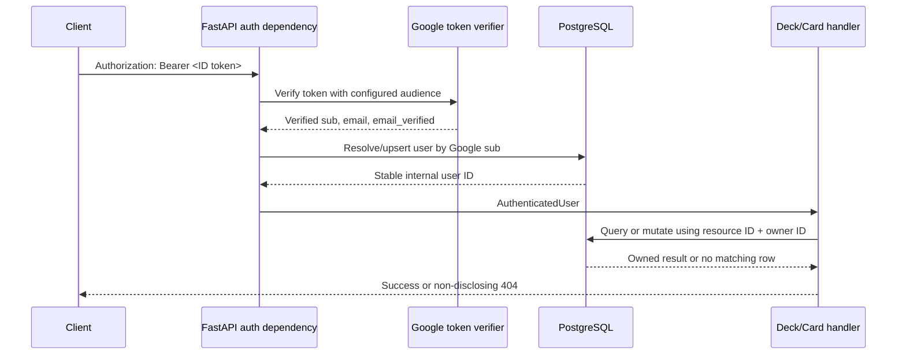

# feat(api): enforce backend authentication and owner authorization

## Summary

這個 PR 將身分驗證（authentication）與資源授權（authorization）的信任邊界，從瀏覽器移到
FastAPI 後端。

在這次改動之前，後端讀取 API 仍使用暫時固定的 owner，尚未真正根據呼叫者身分隔離資料；
瀏覽器端雖然可以解析 Google token 與檢查 email，但前端檢查只能改善使用者體驗，不能作為
安全邊界。任何可以直接呼叫 API 的客戶端，都不應被允許自行宣告 user ID、email 或 owner ID。

完成後，所有 `/v1` 產品 API 都會先由後端驗證 Google ID token，再以 Google `sub` 對應穩定的
內部使用者 ID。所有 deck、card 與 due-review 的讀寫，都使用這個由伺服器取得的內部 ID 進行
ownership 判斷；request body 無法選擇資料擁有者。

Closes #10.

## Why

這個改動主要解決三個問題：

1. **瀏覽器不能是身分安全邊界。** 前端程式與 request payload 都可以被修改，因此不能只相信
   瀏覽器解析出的 email 或 user ID。
2. **通過驗證不等於取得資源授權。** 有效的 Google token 只能證明「呼叫者是誰」，不能證明
   「這張 card 或這個 deck 屬於他」。
3. **ownership 必須由後端一致執行。** list、detail、create、edit、archive 與 due-review query
   都必須使用相同的 authenticated owner，否則只保護部分 endpoint 仍會留下水平越權漏洞。

## Request boundary



這個流程把兩個不同問題分開處理：

- **Authentication boundary：** 驗證 token，回答「呼叫者是誰？」
- **Authorization boundary：** 檢查 resource ID 與 authenticated owner，回答「這位使用者能否操作
  這筆資料？」

## What changed

### 1. Server-side Google ID-token verification

新增可替換的 token verifier 與共用 authenticated-user dependency。後端使用 Google 官方 Python
library，並帶入設定中的 `GOOGLE_OAUTH_CLIENT_ID` 驗證 token。

驗證範圍包含：

- Google 簽章
- issuer
- audience
- expiration
- 必須存在且非空白的 `sub`
- 必須存在且非空白的 email
- `email_verified` 必須為 `true`

驗證成功後，應用程式只保留 allowlist 中需要使用的 identity claims，不會把完整 claims 或原始
ID token 傳入 domain handler。

錯誤行為：

- 缺少 credentials：`401 authentication_required`
- 過期、錯誤 audience、錯誤簽章、malformed token 或無效 claims：
  `401 invalid_authentication`
- Google key-fetch/transport 暫時失敗：`503 identity_provider_unavailable`，並標示
  `retryable: true`

所有 authentication error 都沿用既有的安全 error envelope，且不回傳原始 token、exception、
stack trace 或 provider response。

### 2. Stable internal-user mapping

Google `sub` 是外部身分的穩定識別值，因此用它對應 `users.google_subject`，並取得資料庫產生的
內部 user ID。

email 只作為可更新的 profile data：

- email 會被 trim、case-fold，再儲存為 normalized email。
- 同一個 `sub` 即使 email 改變，仍會取得相同的 internal user ID。
- email 不作為 primary identity，也不參與資源 ownership key。

新增 `GET /v1/me`，只回傳內部 user ID 與 email，不向 client 暴露 Google subject。

### 3. Reusable authenticated-user dependency

原本 read API 使用暫時固定 owner `1`。這個 PR 移除該 temporary boundary，改由所有 `/v1`
產品 routes 共用 `AuthenticatedUser` dependency。

dependency 負責：

1. 取得 Bearer token。
2. 執行 Google token verification。
3. 以 Google `sub` resolve/upsert internal user。
4. 將 server-derived internal user 傳給 route handler。

health endpoints 維持公開，因為 liveness/readiness probe 不代表產品資料存取。

### 4. Owner-scoped reads

deck、card 與 due-review reads 都改為以 authenticated internal owner ID 查詢：

- `GET /v1/decks`
- `GET /v1/decks/{deck_id}`
- `GET /v1/cards`
- `GET /v1/cards/{card_id}`
- `GET /v1/reviews/due`

list endpoints 對其他使用者的資料回傳空集合。detail endpoint 同時使用 resource ID 與 owner ID；
不存在的 ID 與屬於其他使用者的 ID 都回傳相同的 `404`，避免洩漏資源是否存在。

如果 card list 使用 `deck_id` 或 `tag_id` filter，後端也會先確認 filter resource 屬於目前使用者。
只在最終 card query 加 owner filter 並不足夠，因為 foreign filter 本身也可能洩漏其他使用者的
resource existence。

### 5. Owner-derived deck operations

新增以下 deck write APIs：

- `POST /v1/decks`
- `PATCH /v1/decks/{deck_id}`
- `DELETE /v1/decks/{deck_id}`

Create operation 完全使用 authenticated context 中的 owner ID。Pydantic request model 設定
`extra="forbid"`，因此 client 額外傳入 `owner_id`、user ID 或 email 會在 SQL 執行前被拒絕。

Edit operation 要求 client 提供最後讀到的正整數 `version`。SQL 同時比對：

- deck ID
- authenticated owner ID
- expected version

成功時由資料庫原子地增加 version；owned resource 的 stale version 回傳
`409 version_conflict`。

Delete 採 soft archive，不做 physical delete。對相同 owned deck 重複 archive 仍回傳 `204`，因此
archive command 對擁有者具備 idempotent 行為。

### 6. Owner-derived card operations

新增以下 card write APIs：

- `POST /v1/cards`
- `PATCH /v1/cards/{card_id}`
- `DELETE /v1/cards/{card_id}`

Card creation 先驗證指定的 deck 是目前使用者擁有且尚未 archive 的 deck：

- 不存在或屬於其他使用者：`404 deck_not_found`
- 已 archive：`409 deck_archived`

建立 card 時，owner 仍由 authenticated context 寫入，而不是從 payload 取得。Edit 與 archive
使用和 deck 相同的 owner predicate、optimistic version 與 soft-archive 規則。

Card write schema 同時保留既有 domain validation，例如：

- required term 與 meaning
- 支援的 language-related optional fields
- example translation/source 必須搭配 example sentence
- `part_of_speech="other"` 必須提供 detail
- related-word collection 與文字長度限制

### 7. Request transaction and database error handling

共用 database session dependency 現在明確擁有每個 request 的 transaction：

- handler 成功後 commit
- integrity failure rollback 並轉換為安全的 `422 validation_failed`
- SQLAlchemy/database failure rollback 並轉換為 retryable `503 database_unavailable`
- 其他 exception rollback 後交給既有的安全 error handler
- 無論成功或失敗都 close session

這讓 authentication user mapping 與後續的 owner-scoped operation 位於同一個 request transaction
boundary，也避免 route 各自實作不一致的 commit/rollback 行為。

### 8. Configuration and dependencies

- 新增 `GOOGLE_OAUTH_CLIENT_ID` 設定與 `.env.example` 說明。
- local/test 保留安全的 placeholder，讓開發環境可以啟動。
- production 不允許使用預設 placeholder，缺少正式 client ID 時會以 sanitized configuration
  error 停止啟動。
- 新增 `google-auth` 與官方 requests transport 所需 dependency，並更新 lockfile。

## Authorization matrix

| Endpoint | 認證要求 | 授權範圍 | Missing/cross-owner behavior |
| --- | --- | --- | --- |
| `GET /v1/me` | Google ID token | 目前 internal user | 不適用 |
| `GET /v1/decks` | Required | authenticated owner 的 decks | 其他使用者資料不出現在結果中 |
| `GET /v1/decks/{id}` | Required | deck owner | `404 deck_not_found` |
| `POST /v1/decks` | Required | owner 由 server 決定 | client ownership fields 回傳 `422` |
| `PATCH /v1/decks/{id}` | Required | owner + matching version | cross-owner `404`；stale owned version `409` |
| `DELETE /v1/decks/{id}` | Required | deck owner | cross-owner `404`；owned replay `204` |
| `GET /v1/cards` | Required | authenticated owner 的 cards | 其他使用者資料不出現在結果中 |
| `GET /v1/cards/{id}` | Required | card owner | `404 card_not_found` |
| `POST /v1/cards` | Required | owner + active owned deck | foreign deck `404`；archived deck `409` |
| `PATCH /v1/cards/{id}` | Required | owner + matching version | cross-owner `404`；stale owned version `409` |
| `DELETE /v1/cards/{id}` | Required | card owner | cross-owner `404`；owned replay `204` |
| `GET /v1/reviews/due` | Required | owned state + card + deck | foreign selected deck `404` |
| `GET /health/live` | Public | process health | 不適用 |
| `GET /health/ready` | Public | dependency readiness | 不適用 |

## Acceptance criteria mapping

- [x] Client-supplied user IDs or emails cannot select ownership.
  - Write models reject unknown identity fields.
  - SQL inserts bind `AuthenticatedUser.id` directly.
- [x] Protected endpoints reject missing or invalid authentication consistently.
  - `/v1` routes share the same bearer-token dependency and safe error codes.
- [x] A user cannot read or mutate another user's deck, card, or review data by changing an ID.
  - SQL combines resource IDs with authenticated owner ID.
  - Horizontal privilege-escalation tests reuse IDs owned by another user.
- [x] Create operations derive ownership from authenticated context.
  - Deck/card creation never accepts an owner field.
- [x] Logs and errors do not expose raw ID tokens.
  - Authentication tests use recognizable secret strings and assert they do not appear in responses.
- [x] The authorization matrix matches implemented tests.
  - The matrix above corresponds to unit and PostgreSQL HTTP coverage.

## Verification

### Automated tests

```text
uv run pytest tests/unit -q
54 passed, 1 warning

RUN_POSTGRES_INTEGRATION_TESTS=1 uv run pytest -q
152 passed, 1 warning

uv run ruff check .
passed

uv run ruff format --check .
passed

uv lock --check
passed

git diff --check
passed
```

測試包含：

- missing Bearer token
- expired token
- invalid audience
- malformed token
- invalid signature
- missing/invalid claims
- unverified email
- identity-provider transport failure
- error response 不包含原始 token
- 相同 Google `sub` 在 email 改變後仍對應同一 internal user
- owner-scoped deck/card/due-review reads
- 以其他使用者 ID 嘗試 horizontal privilege escalation
- request body 注入 owner ID 或 email
- 使用其他使用者 deck 建立 card
- owned deck/card create、edit 與 archive
- stale optimistic version conflict
- transaction rollback 與 database error sanitization

目前保留一個既有的 FastAPI `TestClient` / `httpx` upstream deprecation warning；它不是本次功能
失敗，也沒有被這個 PR 隱藏。

## Reviewer guide

建議依照以下順序 review：

1. `apps/api/app/auth.py`
   - token verification、claim allowlist、Google `sub` mapping、authenticated-user dependency。
2. `apps/api/app/reads.py`
   - temporary owner 如何被替換，以及每個 read/filter 的 owner predicate。
3. `apps/api/app/writes.py`
   - server-derived ownership、foreign parent check、optimistic version 與 archive behavior。
4. `apps/api/app/database.py`
   - request transaction、rollback 與 safe database error translation。
5. `apps/api/tests/unit/test_auth.py`
   - token/claim failure matrix與 secret redaction。
6. `apps/api/tests/integration/test_auth_and_authorization.py`
   - 真實 PostgreSQL ownership mapping 與 horizontal privilege-escalation evidence。

## Learning checkpoint

### Authentication boundary 是什麼？

Authentication boundary 驗證 Bearer token 的密碼學與標準 claims，然後把可信任的 Google
`sub` 對應成 application internal user。它只回答「這個 request 是誰送的」。

### Authorization boundary 是什麼？

Authorization boundary 在每次資料操作時，同時比對 requested resource ID 與 authenticated
internal owner ID。它回答「這位已知使用者是否可以對這筆資源執行這個 operation」。

### 為什麼 valid token 仍不代表可以存取某張 card？

因為 token 只證明呼叫者具有一個有效身分，沒有包含任意 card 的 ownership。即使攻擊者使用自己
的合法 Google token，把 URL 中的 card ID 換成另一位使用者的 card ID，SQL 仍必須滿足：

```sql
card.id = :requested_card_id
AND card.owner_id = :authenticated_user_id
```

只要 owner 不相符，query 就不會回傳資料，API 會使用和不存在 card 相同的 `404`。這就是防止
horizontal privilege escalation 的核心。

## Out of scope / limitations

- Review write transaction；這是 Issue #11 的範圍。
- Frontend cutover；目前 SvelteKit 使用者流程仍走 Google Apps Script 與 Google Sheets。
- Roles 或 RBAC；目前產品只需要 resource ownership。
- Live Google token/key verification；測試使用可控制的 verifier boundary，沒有宣稱 live provider
  或 production integration 已驗證。
- Remote CI、deployment、production load、latency、throughput 或真實使用者影響。

這個 PR 的證據範圍是本機 automated correctness 與 PostgreSQL authorization integration tests，
不延伸宣稱 production reliability 或 scale。
