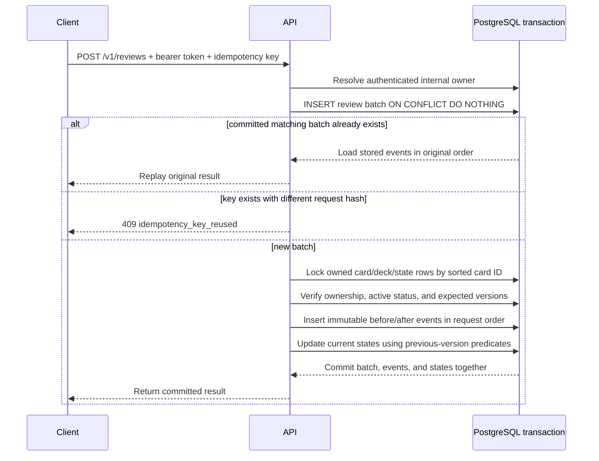

# Issue #11 - Transactional and idempotent review submissions

## Implemented contract

`POST /v1/reviews` requires the authenticated-user dependency and a UUID `Idempotency-Key`
header. Its JSON body contains one through ten unique items:

```json
{
  "items": [
    {
      "card_id": "20000000-0000-0000-0000-000000000001",
      "decision": "yes",
      "expected_version": 2
    }
  ]
}
```

The accepted decisions are `no`, `no_a_bit`, `yes_a_bit`, and `yes`, mapped by `srs-v1` to
qualities 0, 2, 3, and 5. The backend owns the review timestamp and calculates stage, ease,
interval, and next-review time. Clients provide neither owner identity nor resulting schedule.
Newly created cards receive an initial review state in the card-create transaction.

The server hashes the validated item sequence using canonical JSON and SHA-256. Idempotency is
scoped by internal owner:

- A new owner/key/hash executes the transaction.
- The same owner/key/hash returns the stored batch and event result without another transition.
- The same owner/key with a different hash returns `409 idempotency_key_reused`.
- A key used by a different owner is independent.

Malformed or missing keys return `400 invalid_idempotency_key`. Duplicate card IDs or invalid body
data return the common `422 validation_failed` envelope.

## Transaction sequence



The transaction uses pessimistic row locks in a deterministic card-ID order, plus optimistic
`expected_version` checks. Different keys racing on the same state serialize at the lock: the first
commits and the second returns `409 stale_review_state`. Same-key requests serialize at the unique
batch row; the loser reconstructs the winner's committed response. Deterministic lock order avoids
cycles for overlapping multi-card batches.

## Database guarantees and service guarantees

PostgreSQL guarantees unique `(owner_id, idempotency_key)`, one event per `(batch_id, card_id)`,
same-owner batch/card event references, one current state per card, valid scheduling ranges, and
transactional all-or-nothing commit. Row locks prevent concurrent writers from both validating the
same state version.

The service additionally guarantees canonical request comparison, owned and active target checks,
one server time and algorithm version per batch, event/state value agreement, request-order response
reconstruction, and conditional state updates. These cross-row rules are deliberately tested rather
than misrepresented as single-row database constraints.

## Failure and timeout recovery

If validation, ownership, archive status, or any expected version fails, the request transaction
rolls back the new batch and every item. An injected exception after event insertion proves that no
batch, event, or state update remains. Cross-owner card IDs return the same `404 card_not_found` as
missing IDs and cannot create history.

After a client timeout or lost response, the client retries the exact validated body with the same
idempotency key. It receives the original committed result whether the first response was delivered
or ambiguous. It must generate a new key for a logically new review; changing content while keeping
the old key is a conflict, not an update.

## Learning checkpoint

The endpoint is safe because identity, idempotency, authorization, history, and current state meet
inside one database transaction. A unique key alone prevents duplicate command records, but it does
not prove request equivalence; the request hash detects conflicting reuse. A valid token alone proves
who called, but it does not authorize the submitted card IDs; the locked lookup must also match every
card to the authenticated internal owner.

For concurrent different-key submissions, row locking makes version validation occur against the
latest committed state. For failure atomicity, PostgreSQL commits the batch, all immutable events,
and all current-state updates together or retains none of them. This is stronger than attempting to
repair partial writes after an exception.

## Verification

- The complete PostgreSQL-backed backend suite passes 171 tests.
- Review integration coverage includes success, validation, unauthorized ownership, exact replay,
  conflicting key reuse, multi-item ordering, simultaneous same-key and different-key submissions,
  inactive targets, stale versions, and injected rollback.
- Ruff lint and formatting checks pass.
- One existing upstream FastAPI `TestClient`/`httpx` deprecation warning remains.

These are local correctness results. Frontend cutover, Google Sheets import, asynchronous jobs,
remote CI, deployment, production load, and retry handling for transient database deadlocks remain
outside this issue.
