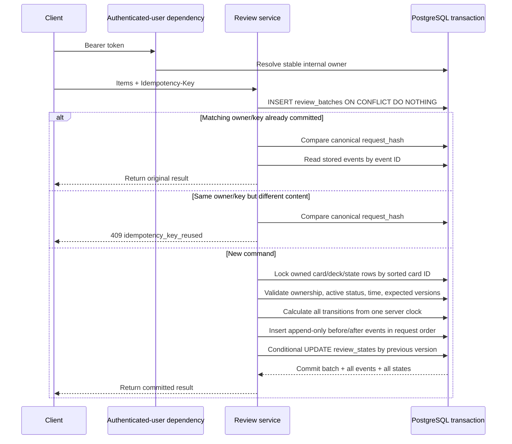

# feat(api): add transactional and idempotent review submissions

## Summary

這個 PR 實作 `POST /v1/reviews`，讓 review submission 在以下情境中仍然保持正確：

- client 因 timeout 或網路中斷而重送同一個 request
- 同一位使用者從兩個 browser tab 同時 review 同一張 card
- 兩個相同 idempotency key 的 request 同時抵達
- multi-card batch 中任一項 validation 或 authorization 失敗
- review event 已寫入，但 current review state 更新前發生 exception

核心保證是：一個成功的 logical review 只會產生一筆 immutable history event 與一次 current-state
transition；相同 request 可以安全重試，不同內容不能冒用舊 key；任何失敗都不會留下 partial batch、
partial event 或 partial state update。

Closes #11.

## Why

原本 Google Apps Script review flow 由 client 計算新的 stage、ease factor 與日期，再逐列更新
Google Sheet。這個模式有幾個風險：

1. **Ambiguous outcome：** client timeout 時無法判斷 server 是否已經完成更新。如果直接重送，可能
   重複套用同一個 review。
2. **Concurrent submission：** 兩個 request 可能同時讀到相同舊 state，再各自覆寫結果，造成
   lost update。
3. **Partial write：** multi-card request 或 event/state 分開寫入時，中途失敗可能只完成部分資料。
4. **Trust boundary：** client 不應決定 owner、review timestamp 或最終 scheduling state。
5. **Auditability：** current state 若更新但沒有一致的 before/after event，就無法解釋狀態如何形成。

這個 PR 將 identity、ownership、idempotency、history 與 current state 放在同一個 PostgreSQL
transaction boundary 中處理。

## API contract

### Endpoint

```http
POST /v1/reviews
Authorization: Bearer <Google ID token>
Idempotency-Key: <UUID>
Content-Type: application/json
```

### Request

```json
{
  "items": [
    {
      "card_id": "20000000-0000-0000-0000-000000000001",
      "decision": "yes",
      "expected_version": 2
    }
  ]
}
```

Request rules：

- `items` 必須包含 1 到 10 項。
- 同一個 batch 不能重複出現相同 `card_id`。
- `expected_version` 必須是正整數。
- `decision` 只能是：
  - `no`
  - `no_a_bit`
  - `yes_a_bit`
  - `yes`
- Request model 設定 `extra="forbid"`。
- Client 不能傳入：
  - owner ID
  - user ID 或 email
  - quality
  - review timestamp
  - resulting stage
  - ease factor
  - interval
  - next-review time
- `Idempotency-Key` 必須是合法 UUID。

### Success response

```json
{
  "batch_id": "40000000-0000-0000-0000-000000000002",
  "reviewed_at": "2026-09-04T16:30:00Z",
  "algorithm_version": "srs-v1",
  "items": [
    {
      "event_id": 3,
      "card_id": "20000000-0000-0000-0000-000000000001",
      "decision": "yes",
      "quality": 5,
      "previous_state": {
        "review_stage": 2,
        "ease_factor": "2.50",
        "interval_days": 1,
        "last_reviewed_at": "2026-09-02T12:00:00Z",
        "next_review_at": "2026-09-03T00:00:00Z",
        "version": 2
      },
      "resulting_state": {
        "review_stage": 3,
        "ease_factor": "2.50",
        "interval_days": 18,
        "last_reviewed_at": "2026-09-04T16:30:00Z",
        "next_review_at": "2026-09-22T16:00:00Z",
        "version": 3
      }
    }
  ]
}
```

Response 包含 event ID、before/after state、server review time 與 algorithm version，因此 client
在第一次 response 遺失後，可以透過相同 key 取回原本已 commit 的結果。

## Idempotency design

### Identity of one logical command

Idempotency identity 由以下組合決定：

```text
(authenticated internal owner ID, Idempotency-Key)
```

同一個 UUID 可以由不同使用者獨立使用，不會形成跨使用者 collision。

### Canonical request hash

只靠 idempotency key 無法判斷 retry 的內容是否相同。因此 server 會在 Pydantic validation 後，
將每個 item 正規化成：

```json
{
  "card_id": "canonical UUID string",
  "decision": "yes",
  "expected_version": 2
}
```

接著以固定 key ordering、compact JSON separators 與 SHA-256 產生 `request_hash`。JSON property
排列或空白差異不會改變 hash，但 item sequence 會保留，因為 response 也必須維持 client 的提交
順序。

### Key behavior matrix

| 情境 | 結果 | Database effect |
| --- | --- | --- |
| 新 owner + 新 key + 新 content | 執行 review transaction | 建立一個 batch、每張 card 一個 event、每張 card 一次 state transition |
| 相同 owner + 相同 key + 相同 content | 回傳原始結果 | 不新增 batch/event，不再次更新 state |
| 相同 owner + 相同 key + 不同 content | `409 idempotency_key_reused` | 不產生新 effect |
| 不同 owner + 相同 key | 視為獨立 command | 各自在自己的 ownership scope 執行 |
| Missing/malformed key | `400 invalid_idempotency_key` | 不產生 effect |

### Why store the result as events

`review_batches` 儲存 command-level metadata：

- owner
- idempotency key
- canonical request hash
- server review timestamp
- algorithm version
- item count

`review_events` 儲存每個 item 的完整 previous/resulting state。Retry 不需要重新執行 scheduling
algorithm，也不依賴目前可能已再次改變的 `review_states`；它直接從已 commit 的 event snapshots
重建原始 response。

## Transaction sequence



Request-scoped SQLAlchemy session dependency 明確擁有 transaction lifecycle：route 成功後 commit；
任何 `ApiError`、database error 或 unexpected exception 都會 rollback；最後一定 close session。

## Step-by-step implementation

### 1. Authenticate and derive ownership

Endpoint 使用 Issue #10 建立的 `AuthenticatedUser` dependency。Client 只提交 card ID，owner ID
由 server-verified Google identity 對應的 internal user 決定。

Authentication 本身不代表 card authorization。後續 locked query 仍必須同時滿足：

```sql
c.id IN (:requested_card_ids)
AND c.owner_id = :authenticated_owner_id
```

任一 card 不存在或屬於其他使用者，整個 request 回傳 `404 card_not_found`，而且不留下 review
batch 或 history。

### 2. Claim the idempotency key

Server 先嘗試：

```sql
INSERT INTO review_batches (...)
ON CONFLICT (owner_id, idempotency_key) DO NOTHING
RETURNING ...
```

如果 insert 成功，這個 transaction 成為新 command 的執行者。如果 insert 沒有回傳 row，代表
相同 owner/key 已存在；PostgreSQL 會在 concurrent winner 完成 commit/rollback 後再決定 conflict，
因此 loser 不需要在 application memory 中建立 lock table。

### 3. Handle replay or conflicting reuse

Key 已存在時，server 讀取 stored request hash：

- hash 相同：依 `review_events.id ASC` 重建並回傳原始 result。
- hash 不同：回傳 `409 idempotency_key_reused`。

Replay path 不重新取得 card state、不重新執行 algorithm，也不新增任何資料。

### 4. Lock targets deterministically

新 command 將所有 card IDs 排序後，以一個 owned join query 取得並鎖定：

- `learning_cards`
- parent `learning_decks`
- `review_states`

```sql
ORDER BY c.id ASC
FOR UPDATE OF c, d, s
```

固定 lock order 可以降低兩個 overlapping multi-card batches 以不同 request order 取得 locks 時的
deadlock 風險。Request response 仍使用原始 item order，不受 internal lock order 影響。

### 5. Validate the complete batch before mutation

在寫入第一個 event 之前，server 先驗證所有 items：

- card 與 deck 屬於 authenticated owner
- card 與 deck 尚未 archive
- current review state 存在
- `expected_version` 等於 locked current version
- server review time 不早於 state 的 last-review time

因此 multi-card batch 的第二項若 stale，第一項也不會先留下 event 或 state update。

### 6. Calculate server-owned transitions

所有 item 使用同一個 `reviewed_at` 與 `srs-v1` algorithm version。

Decision mapping：

| Decision | Quality | Stage direction |
| --- | ---: | --- |
| `no` | 0 | -1 |
| `no_a_bit` | 2 | -1 |
| `yes_a_bit` | 3 | +1 |
| `yes` | 5 | +1 |

其他 scheduling rules：

- stage clamp 在 1 到 5。
- ease factor 使用修正後的公式與 Decimal arithmetic。
- ease factor clamp 在 1.30 到 2.50，並以 half-up 保留兩位小數。
- interval 以 stage base interval 乘 ease factor，再使用 half-up rounding。
- due date 使用 `Asia/Taipei` calendar day。
- next-review time 設為目標日期的台北午夜，再轉為 UTC 儲存與傳輸。
- resulting version 固定為 previous version + 1。

Client 無法覆寫其中任何 resulting value。

### 7. Append events before updating current state

每個 request item 依原始順序新增一筆 `review_events`，保存完整 before/after snapshots。Service
沒有 event update endpoint；history 以 append-only contract 使用。

Events 寫入後，才用以下條件更新 current state：

```sql
WHERE card_id = :card_id
  AND owner_id = :owner_id
  AND version = :previous_version
```

即使 locked-row assumptions 因未預期因素失效，conditional update 仍提供最後一道 optimistic
version protection。Row count 不等於一時，transaction 會失敗並 rollback。

### 8. Commit or roll back everything

只有 route 完整回傳成功結果後，request session 才 commit。Transaction 包含：

- authenticated user resolution 中必要的 database operation
- review batch
- 所有 review events
- 所有 review state updates

任何中途 failure 都會 rollback 完整 unit of work。

## Concurrency policy

本 PR 選擇「pessimistic row locking + optimistic version validation + conditional update」的組合，
而不是只依賴 application-level lock。

| Concurrent case | Behavior |
| --- | --- |
| 相同 key、相同 content | Unique constraint 只允許一個 batch；另一個 request 等待後 replay 相同結果 |
| 相同 key、不同 content | Winner 正常處理；另一個 request 等待後得到 deterministic `409` |
| 不同 key、相同 card/version | 第一個 request commit；第二個取得 lock 後看到新 version，回傳 `409 stale_review_state` |
| 不同 key、不同 cards | 沒有相同 target row 時可各自執行 |
| Overlapping multi-card batches | Target IDs 以固定順序 lock，避免因 request item order 不同形成反向 lock order |

這裡沒有宣稱所有 PostgreSQL deadlock 都不可能發生。Transient deadlock/serialization failure 的
通用 retry policy 仍是後續 hardening；本 ticket 驗證的是已定義的同 card conflict behavior。

## Authentication concurrency adjustment

Issue #10 的 user mapping 原本使用 `INSERT ... ON CONFLICT DO UPDATE`。即使 email 沒有改變，
`DO UPDATE` 仍可能鎖住 user row，讓同一位使用者的 concurrent review requests 在到達 review
state lock 前就被意外 serialise。

這個 PR 將流程調整為：

1. 先依 Google `sub` 查詢 existing user。
2. email 相同時不執行 write。
3. email 改變時才 update profile data。
4. user 不存在時以 conflict-safe insert 建立。

這保留 stable identity 與 email refresh 行為，同時讓 concurrency test 真正競爭 review rows，而
不是被不相關的 user-row write 預先序列化。

## Initial review state for new cards

Card creation 現在會在同一個 create-card transaction 中新增初始 `review_states`：

- `review_stage = 1`
- `ease_factor = 2.50`
- `interval_days = 0`
- `last_reviewed_at = NULL`
- `next_review_at = CURRENT_TIMESTAMP`
- `version = 1`

這使新建立的 card 立即符合 review service 所需 invariant，不會出現 card 已存在但沒有 current
state、因此永遠無法提交 review 的情況。

## Database guarantees versus service guarantees

### PostgreSQL guarantees

- `UNIQUE (review_batches.owner_id, review_batches.idempotency_key)`：同一 owner/key 最多一個
  command batch。
- `UNIQUE (review_events.batch_id, review_events.card_id)`：同一 batch/card 最多一個 event。
- Composite foreign keys：event 的 batch、card 與 owner 必須屬於相同 ownership boundary。
- `review_states.card_id` primary key：每張 card 最多一個 current state。
- Review event checks：decision/quality mapping、stage/ease/interval ranges、version progression、
  timestamp ordering。
- Transaction atomicity：batch、events 與 current states 全部 commit，或全部 rollback。
- Row locks：兩個 writer 不能同時在相同 locked state version 上完成 validation。

`(owner_id, idempotency_key)` uniqueness 已在先前的 domain-schema migration 中建立並完成 constraint
tests。Issue #11 直接使用這個既有 invariant，因此不需要新增 migration。

### Service guarantees

- Canonical request hash 與 conflicting-content comparison。
- 一個 batch 共用同一 server time 與 algorithm version。
- Ownership 與 active card/deck validation。
- Scheduling algorithm 與 Taipei calendar-day calculation。
- Event snapshots 與 resulting current state 的 value agreement。
- Request-order response 與 replay reconstruction。
- Multi-item all-or-nothing orchestration。

這些跨多 row 或需要 domain algorithm 的規則無法全部用單一 database constraint 表達，因此由
service transaction 實作，並以真實 PostgreSQL integration tests 驗證；不是只靠 mock 或 SQLite。

## Error behavior

| Status | Code | Condition | Retry with same key? |
| ---: | --- | --- | --- |
| `400` | `invalid_idempotency_key` | Missing 或 malformed UUID key | 修正 key 後再送 |
| `401` | `authentication_required` | 缺少 Bearer token | 先重新驗證身分 |
| `401` | `invalid_authentication` | Token 無效或過期 | 取得新 token |
| `404` | `card_not_found` | Card 不存在或不屬於 caller | 否；確認 card selection |
| `409` | `idempotency_key_reused` | 相同 owner/key 搭配不同 content | 不可；新 logical command 必須換 key |
| `409` | `stale_review_state` | Current version 已改變 | 重新讀取 state，建立新 request 與新 key |
| `409` | `review_target_inactive` | Card 或 deck 已 archive | 不可直接重試 |
| `409` | `review_time_conflict` | Server time 早於 current state | 等 clock/state 問題修正 |
| `422` | `validation_failed` | Body shape、range 或 duplicate card 無效 | 修正 body 後使用適當 key |
| `503` | `database_unavailable` | Database failure | 可依 client retry policy 重試相同 request/key |

所有錯誤沿用既有 safe error envelope，不回傳 SQL、exception、credentials 或 raw ID token。

## Client recovery after timeout

Client 必須為「一次 logical review submission」產生一個 UUID，並在 retry 時保存：

- 相同 `Idempotency-Key`
- 完全相同的 validated request content

Timeout 後的處理方式：

1. 不猜測第一次 request 是否成功。
2. 不先在 client 再次套用 scheduling transition。
3. 使用相同 body 與相同 key 重送。
4. 如果第一次已 commit，server 回傳原始 result。
5. 如果第一次 rollback 或根本沒有抵達，retry 成為執行該 command 的 request。
6. 收到 `idempotency_key_reused` 時不要自動換 key 重送不同內容；這代表 client command tracking
   有 bug，應先停止並重新建立新的 logical submission。

## Test coverage

### Unit tests

`apps/api/tests/unit/test_review_submissions.py` 驗證：

- Equivalent JSON property order 產生相同 canonical hash。
- Item order 不同不會被誤認為同一個 command。
- Duplicate cards 被 validation 擋下。
- Server-owned fields 無法由 request 注入。
- 四種 decision 都產生 deterministic quality、stage、ease、interval 與 version。
- Due time 使用台北 calendar day midnight 並轉成 UTC。

Authentication suite 也加入 `POST /v1/reviews`，確認 missing authentication 一致回傳 `401`。

### PostgreSQL integration tests

`apps/api/tests/integration/test_review_submission_transactions.py` 驗證：

- 一張 card 成功產生一個 event 與 matching current-state transition。
- 相同 key/body replay 完全相同 response，而且不增加 effect count。
- Multi-card batch 依 request order 回傳與 replay，即使 lock order 是 sorted card ID。
- 相同 key 搭配不同 decision 被 deterministic rejection。
- Missing/malformed idempotency key。
- Duplicate-card validation 不留下 batch/event。
- Batch 中後面的 item stale 時，前面的 item 也完全 rollback。
- 其他使用者的 card 與 archived target 不建立 history。
- Event insert 後注入 exception，驗證 batch、event、state 全部 rollback。
- 兩個不同 key 同時 review 相同 version：一個 `200`、一個 `409 stale_review_state`。
- 兩個相同 key 同時送出：兩個 response 都是 `200` 且內容相同，database 只有一次 effect。

Concurrency tests 使用兩個獨立 `TestClient`、兩個 database sessions、`ThreadPoolExecutor` 與 barrier，
避免測試 framework 在進入 PostgreSQL 前就把 request serialise。這些測試實際使用 PostgreSQL 17，
不是在單一 session 中模擬 race。

## Acceptance criteria mapping

- [x] **One logical review creates one event and one state transition.**
  - Success test 比對 event resulting snapshot 與 current state。
- [x] **Replaying the same request and idempotency key does not duplicate effects.**
  - Sequential 與 simultaneous same-key tests 都只產生一次 database effect。
- [x] **Reusing a key with different content is rejected deterministically.**
  - Canonical request hash mismatch 回傳 `409 idempotency_key_reused`。
- [x] **Concurrent conflicting submissions have documented, tested behavior.**
  - Different-key race 明確產生一個 success 與一個 stale conflict；same-key race replay winner。
- [x] **A failed transaction leaves neither a partial event nor a partial state update.**
  - Multi-item validation failure與 event/state 中間的 injected exception 都驗證 rollback。
- [x] **Another user's card cannot be reviewed.**
  - Owned locked lookup 回傳非揭露式 `404`，並驗證 history count 不變。
- [x] **The design can be explained in terms of database guarantees rather than application checks alone.**
  - Unique constraints、composite foreign keys、checks、row locks、conditional versions 與 atomic
    transaction 各自有明確責任與 PostgreSQL test evidence。

## Verification

```text
RUN_POSTGRES_INTEGRATION_TESTS=1 uv run pytest -q
171 passed, 1 warning

uv run ruff check .
passed

uv run ruff format --check .
passed

uv lock --check
passed

git diff --check
passed
```

唯一 warning 是既有的 FastAPI `TestClient` / `httpx` upstream deprecation warning。它不是本次
transaction、concurrency 或 idempotency failure，也沒有被隱藏。

這些結果代表本機 correctness 與真實 PostgreSQL integration verification，不代表 production
throughput、latency、availability 或 deployed user impact。

## Reviewer guide

建議 review 順序：

1. `apps/api/app/reviews.py`
   - Request/response contract、hash、transition、replay、locking 與 transaction orchestration。
2. `apps/api/tests/integration/test_review_submission_transactions.py`
   - 先確認 observable guarantees，特別是 rollback 與真正的 concurrent sessions。
3. `apps/api/tests/unit/test_review_submissions.py`
   - Canonical hashing 與 deterministic scheduling vectors。
4. `apps/api/app/auth.py`
   - 為何移除 unchanged-email 的 no-op update，以及它與 concurrency 的關係。
5. `apps/api/app/writes.py`
   - Card creation 如何在同一 transaction 建立 initial review state。
6. `doc/training/issues/issue-11/README.md`
   - Transaction sequence、database/service guarantee boundary 與 timeout recovery。

## Learning checkpoint

### 為什麼 idempotency key 本身不夠？

Unique key 只能保證同一 owner/key 不會有兩個 batch，不能證明第二次 request 的內容與第一次相同。
搭配 canonical request hash 後，server 才能區分「安全 retry」與「client 錯誤地重用 key」。

### 為什麼同時需要 row lock 與 expected version？

`FOR UPDATE` 讓 competing writers 對同一 current state 排隊，避免兩個 request 同時以舊值完成
transition。`expected_version` 則表達 client 的前提：這個 decision 是針對它最後看到的哪一版
state。第一個 request commit 後，第二個 request 取得 lock 並看到新 version，因此 deterministic
地回傳 stale conflict，而不是覆寫第一個結果。

Conditional update 再次要求 previous version，是防止 implementation assumption 被破壞時的最後一道
保護。

### PostgreSQL 真正保證了什麼？

PostgreSQL 保證 key uniqueness、ownership referential integrity、event uniqueness、value ranges、
row-lock serialization，以及 transaction 的 all-or-nothing commit。Service 負責 canonicalization、
domain scheduling 與跨 row orchestration。完整設計不是只說「我們有 transaction」，而是能指出每個
invariant 由哪一層執行和驗證。

### Timeout 後為什麼不能直接產生新 key？

因為 client 不知道第一次 request 是否已 commit。直接產生新 key 會讓 server 將 retry 視為新的
logical review，可能造成第二個 event 與第二次 state transition。正確方式是以同一 body 和同一 key
查回原始結果。

## Out of scope / limitations

- Google Sheets import。
- Frontend cutover；目前使用者介面尚未呼叫此 endpoint。
- Async jobs 或 queue。
- Production deployment、remote CI、load test、latency 或 throughput claims。
- 通用的 transient PostgreSQL deadlock/serialization retry policy。
- Review history event 的 database-level UPDATE/DELETE trigger；目前 immutable 是 service append-only
  contract，加上 schema constraints 與沒有 mutation endpoint。若未來需要防止 privileged direct SQL
  修改，可以再加入 database permissions 或 trigger hardening。

這個 PR 的證據範圍是本機 automated correctness、真實 PostgreSQL transaction tests 與 deterministic
concurrency behavior；不延伸宣稱 production reliability 或 scale。
