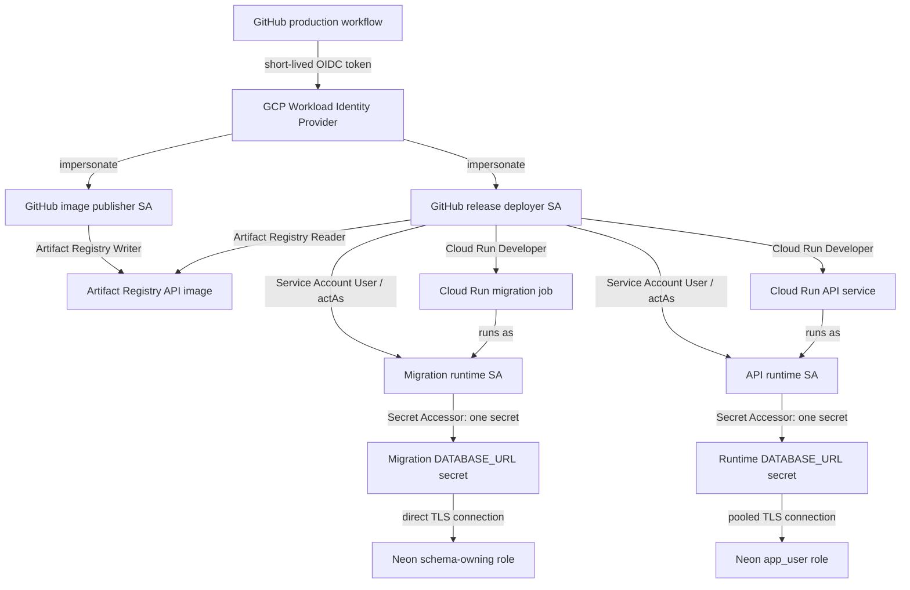

# GitHub、GCP 與 Neon 身份和設定維護筆記

最後更新：2026-09-15

這份文件集中記錄 production release automation 中 GitHub Actions、Google Cloud 與 Neon 的
信任關係、身份、權限、Variables 和 secrets。實際執行步驟仍以 [`runbook.md`](runbook.md) 為準；
較完整的部署背景與資料庫權限 SQL 在
[`deployment-notes.zh-TW.md`](deployment-notes.zh-TW.md)。

這裡只記錄非敏感的 resource name、用途與權限關係。不要把 Neon 密碼、完整 connection string、
Google ID token、OIDC token 或 service-account key 寫進 repository。

## 目前狀態

| 邊界                          | 狀態                         | 證據限制                                                              |
| ----------------------------- | ---------------------------- | --------------------------------------------------------------------- |
| GitHub OIDC → GCP WIF         | 操作者回報已成功             | Publish 與 migration Actions 均已透過 WIF 執行；run ID 尚未記錄       |
| Publish API container         | 操作者回報已成功             | Artifact Registry image 已能由 Action 發布與驗證                      |
| Migrate production PostgreSQL | 操作者回報已成功             | Cloud Run job、Alembic upgrade/head check 與 runtime readiness 已通過 |
| Deploy API candidate          | Workflow 已在本機建立並檢查  | 遠端 Action 尚未執行                                                  |
| API runtime service account   | Candidate 首次執行前必須確認 | 建立狀態與 IAM bindings 尚未記錄為已驗證                              |

## 整體信任與執行關係



GitHub runner 不會取得 Neon URL。`--set-secrets` 只把 Secret Manager resource reference 寫入
Cloud Run job 或 service；真正啟動 container 時，對應的 Cloud Run runtime identity 才能讀取
secret payload。

## 身份與責任

| 身份                       | 目前名稱或 Variable                                                                                                   | 可以做什麼                                                                                           | 明確不需要什麼                                                |
| -------------------------- | --------------------------------------------------------------------------------------------------------------------- | ---------------------------------------------------------------------------------------------------- | ------------------------------------------------------------- |
| GitHub image publisher     | `GCP_GITHUB_PUBLISH_SERVICE_ACCOUNT` → `github-production-publish@eng-learning-470909.iam.gserviceaccount.com`        | 透過 WIF 登入；在 `language-learning` repository push/describe images                                | Cloud Run、Service Account User、Secret Accessor              |
| GitHub release deployer    | `GCP_GITHUB_SERVICE_ACCOUNT` → 操作者回報為 `github-production-migration@eng-learning-470909.iam.gserviceaccount.com` | 透過 WIF 登入；讀 image；部署/執行 migration job；部署 API candidate；attach 兩個 runtime identities | 讀取任何 Neon secret                                          |
| Migration runtime identity | `MIGRATION_SERVICE_ACCOUNT` → `english-learning-migrate@eng-learning-470909.iam.gserviceaccount.com`                  | Cloud Run migration job 的執行身份；只讀 migration secret                                            | Cloud Run Developer、Artifact Registry 管理、runtime secret   |
| API runtime identity       | `RUNTIME_SERVICE_ACCOUNT` → `english-learning-api@eng-learning-470909.iam.gserviceaccount.com`                        | Cloud Run API revision 的執行身份；只讀 runtime secret                                               | Cloud Run Developer、Artifact Registry 管理、migration secret |
| Neon schema identity       | 目前為 `neondb_owner`                                                                                                 | Alembic schema migration 與擁有既有 database objects                                                 | 不提供給 web runtime                                          |
| Neon application identity  | `app_user`                                                                                                            | 應用程式所需 table DML 與 sequence use/select                                                        | 建立/修改 schema、owner 或 Neon 高權限 membership             |

Service account 的顯示名稱不影響 workflow；GitHub Variable 必須保存完整 email。若 Console 中的
實際 email 不同，以 **IAM & Admin → Service Accounts** 顯示的 email 為準，並同步修改 GitHub
`production` Environment Variable 與本文件。

## IAM bindings 放在哪裡

| Principal                       | Role                           | Scope / target                           | 原因                                                                   |
| ------------------------------- | ------------------------------ | ---------------------------------------- | ---------------------------------------------------------------------- |
| GitHub production WIF principal | Workload Identity User         | image publisher service account          | 允許符合 repository/environment condition 的 job impersonate publisher |
| GitHub production WIF principal | Workload Identity User         | release deployer service account         | 允許符合 repository/environment condition 的 job impersonate deployer  |
| Image publisher SA              | Artifact Registry Writer       | `language-learning` repository           | Build 後 push immutable image                                          |
| Release deployer SA             | Artifact Registry Reader       | `language-learning` repository           | Migration/candidate 執行前確認 image 存在                              |
| Release deployer SA             | Cloud Run Developer            | project 或預先建立的 Cloud Run resources | 部署/執行 migration job與建立 candidate revision                       |
| Release deployer SA             | Service Account User           | migration runtime SA 本身                | 讓 deployer 可在 Cloud Run job 使用 migration identity                 |
| Release deployer SA             | Service Account User           | API runtime SA 本身                      | 讓 deployer 可在 Cloud Run service 使用 API runtime identity           |
| Migration runtime SA            | Secret Manager Secret Accessor | migration secret 本身                    | Alembic container 啟動時取得 direct URL                                |
| API runtime SA                  | Secret Manager Secret Accessor | runtime secret 本身                      | FastAPI container 啟動時取得 pooled URL                                |

`Service Account User` 應加在被 attach 的 service account 資源上，而不是為了方便直接授予整個
project。Secret Accessor 也應加在單一 secret 上。這能保持 publisher、deployer、migration 和
runtime 四個責任邊界。

Cloud Run 另有 Google-managed service agent；正常情況下由平台管理 image pull 等能力，不要把它
和上述 user-managed runtime service accounts 混用或替換。

## GitHub production Environment Variables

三個 backend release workflows 都使用 GitHub `production` Environment，並共用
`production-api-release` concurrency group。下表中的 `P`、`M`、`C` 分別表示 Publish、Migration
和 Candidate workflow。

| Variable                             |  P  |  M  |  C  | 值的來源與用途                                                                  |
| ------------------------------------ | :-: | :-: | :-: | ------------------------------------------------------------------------------- |
| `ARTIFACT_REGION`                    |  ✓  |  ✓  |  ✓  | Artifact Registry location；目前為 `asia-east1`                                 |
| `ARTIFACT_REPOSITORY`                |  ✓  |  ✓  |  ✓  | Artifact Registry repository；目前為 `language-learning`                        |
| `API_IMAGE_NAME`                     |  ✓  |  ✓  |  ✓  | Repository 內的 image 名稱；目前為 `api`                                        |
| `GCP_PROJECT_ID`                     |  ✓  |  ✓  |  ✓  | GCP Project ID；目前為 `eng-learning-470909`                                    |
| `GCP_WORKLOAD_IDENTITY_PROVIDER`     |  ✓  |  ✓  |  ✓  | WIF provider 完整 resource name，開頭使用數字 Project number                    |
| `GCP_GITHUB_PUBLISH_SERVICE_ACCOUNT` |  ✓  |     |     | Publisher 的完整 service-account email                                          |
| `GCP_GITHUB_SERVICE_ACCOUNT`         |     |  ✓  |  ✓  | Release deployer 的完整 service-account email                                   |
| `GCP_REGION`                         |     |  ✓  |  ✓  | Cloud Run region；目前為 `asia-southeast1`                                      |
| `MIGRATION_JOB`                      |     |  ✓  |     | Cloud Run job 名稱；目前為 `english-learning-api-migrate`                       |
| `MIGRATION_SERVICE_ACCOUNT`          |     |  ✓  |     | Migration runtime identity 的完整 email                                         |
| `MIGRATION_DATABASE_SECRET`          |     |  ✓  |     | Migration direct URL 的 Secret Manager secret **名稱**                          |
| `MIGRATION_DATABASE_SECRET_VERSION`  |     |  ✓  |     | 核准的固定數字版本；不要使用 `latest`                                           |
| `PUBLIC_API_BASE_URL`                |     |  ✓  |     | 既有正式 Cloud Run HTTPS origin；migration 後檢查 readiness                     |
| `API_SERVICE`                        |     |     |  ✓  | Cloud Run API service 名稱；目前為 `english-learning-api`                       |
| `RUNTIME_SERVICE_ACCOUNT`            |     |     |  ✓  | API runtime identity 的完整 email                                               |
| `RUNTIME_DATABASE_SECRET`            |     |     |  ✓  | Runtime pooled URL 的 Secret Manager secret **名稱**                            |
| `RUNTIME_DATABASE_SECRET_VERSION`    |     |     |  ✓  | 核准的固定數字版本；candidate workflow 拒絕 `latest`                            |
| `PUBLIC_GOOGLE_AUTH_CLIENT_ID`       |     |  ✓  |  ✓  | Google Web OAuth client ID；workflow 映射為 backend 的 `GOOGLE_OAUTH_CLIENT_ID` |
| `CORS_ALLOWED_ORIGINS`               |     |  ✓  |  ✓  | JSON array；只包含 frontend origin，不包含 repository path                      |

這些值都是 resource locator 或公開設定，使用 GitHub Actions `vars` context。三個 backend release
Actions 不需要 GitHub Actions `secrets` context。`PUBLIC_` 代表它也會提供給 SvelteKit browser
build；`PUBLIC_GOOGLE_AUTH_CLIENT_ID` 是 OAuth audience identifier，不是 client secret。

Workflow confirmation 是手動輸入，不是 Environment Variable：

| Workflow                      | Confirmation           |
| ----------------------------- | ---------------------- |
| Publish API container         | `publish-api-image`    |
| Migrate production PostgreSQL | `migrate-production`   |
| Deploy API candidate          | `deploy-api-candidate` |

Workflow 內有兩個刻意重用的名稱映射：

- Migration 以 `vars.PUBLIC_API_BASE_URL` 設定內部的 `API_BASE_URL`，不另存相同的 URL。
- Migration 與 candidate 都以 `vars.PUBLIC_GOOGLE_AUTH_CLIENT_ID` 設定 container 的
  `GOOGLE_OAUTH_CLIENT_ID`，讓 browser 取得的 Google ID token 與 backend 驗證的 audience 一致。

### Frontend GitHub Pages Action 的關係

`.github/workflows/deploy.yml` 在 `main` push 或手動觸發時部署 GitHub Pages。它不使用 GCP WIF、
上述 GCP service accounts、Secret Manager 或 Neon connection；但它會在 build 時使用 repository
Variables：

| Variable                       | 與 backend 的關係                                                         |
| ------------------------------ | ------------------------------------------------------------------------- |
| `PUBLIC_API_BASE_URL`          | Browser API client 指向已 promotion 的正式 Cloud Run origin               |
| `PUBLIC_GOOGLE_AUTH_CLIENT_ID` | 與 Cloud Run backend 的 `GOOGLE_OAUTH_CLIENT_ID` 必須相同                 |
| `PUBLIC_EMAIL_WHITE_LIST`      | Client-visible UX gate；不是 backend authN/authZ，也不能取代 owner checks |

Frontend workflow 使用自己的 `pages` concurrency group，不會被
`production-api-release` 自動排序。若 frontend change 依賴新的 API contract，必須先完成 backend
candidate smoke 與 promotion，再讓新 frontend 接收正常流量。

## GCP Secret Manager 與 Neon connections

| Secret resource                       | Secret payload              | 讀取者               | Neon endpoint / role                    | 使用時機                             |
| ------------------------------------- | --------------------------- | -------------------- | --------------------------------------- | ------------------------------------ |
| `english-learning-neon-migration-url` | 完整 SQLAlchemy/Psycopg URL | Migration runtime SA | direct endpoint / 目前為 `neondb_owner` | Alembic upgrade 與 head verification |
| `english-learning-neon-runtime-url`   | 完整 SQLAlchemy/Psycopg URL | API runtime SA       | pooled endpoint / `app_user`            | FastAPI reads、writes 與 readiness   |

兩個 connection strings 都以 `DATABASE_URL` 注入 container，因為同一個 image 同時包含 FastAPI
與 Alembic。差異來自「哪一個 Cloud Run resource、runtime identity、secret 和 Neon role」在執行，
不是來自不同的 application setting 名稱。

兩者都使用 `postgresql+psycopg://` 並要求 TLS。TLS 保護傳輸；Neon login role 和 PostgreSQL
grants 決定 database capability；FastAPI 驗證 Google ID token 並以 owner-scoped query 執行產品層
authorization。這三層不能互相取代，目前沒有用 PostgreSQL RLS 取代 backend ownership checks。

`neondb_owner` 暫時仍用於 migration，是因為既有 objects 由它擁有。日後若改成專用 migration
role，需要一起處理 object ownership、`ALTER DEFAULT PRIVILEGES`、migration secret 和既有 objects
grants，不能只換 connection string。

## 三個 Actions 的交接契約

所有步驟必須選擇同一個 Git ref。每個 workflow 使用 `GITHUB_SHA` 前 12 碼形成 immutable image
tag：

```text
asia-east1-docker.pkg.dev/eng-learning-470909/language-learning/api:<12-char-sha>
```

1. **Publish API container** build `apps/api`、push image，並拒絕覆寫既有 tag。它不接觸 Cloud Run
   或 Neon。
2. **Migrate production PostgreSQL** 確認同 SHA image 存在，以 migration runtime identity 執行
   `alembic upgrade head` 與 `current --check-heads`，最後檢查正式 API readiness。它不部署 app。
3. **Deploy API candidate** 確認同 SHA image 和既有 service，以 API runtime identity 和固定版本
   runtime secret 建立 `candidate` tag、`0%` production traffic 的 revision，再檢查 public health。
4. 操作者對 candidate URL 執行 authenticated owned-read 與 controlled idempotent review-write smoke。
5. Smoke 成功後才手動 promote；需要回復時只把 traffic 指回 schema-compatible revision，不自動
   downgrade database。

共用 concurrency group 只保證三個 workflow 不同時執行，不會自動替操作者保證 ref 相同或順序
正確。

## 日常維護清單

### 發布新的 application commit

1. 確認 migration 對目前 production revision backward-compatible。
2. 對同一個 ref 依序執行 publish → migrate → candidate。
3. 保存三個 Action summaries 中的 image、revision、traffic 與結果。
4. 對 candidate 做 authenticated smoke，再人工 promote。

### 輪替 Neon password 或 connection string

1. 在 Neon 建立/輪替對應 role credential。
2. 在既有 Secret Manager secret 新增 version，不覆寫或刪除舊版本。
3. 更新對應的 `*_DATABASE_SECRET_VERSION` GitHub Variable 為明確數字。
4. 部署 candidate 並驗證；promotion 穩定後才停用舊 secret version/credential。
5. Migration 與 runtime credential 分開輪替；不要把 owner credential 放進 runtime secret。

### 更換 service account

1. 先建立新 account 與最小權限 bindings。
2. 若為 GitHub identity，先增加 WIF impersonation binding；若為 Cloud Run identity，先增加對單一
   secret 的 Secret Accessor。
3. 讓 release deployer 對新的 Cloud Run identity 取得 Service Account User。
4. 最後才更新 GitHub Environment Variable 並執行對應 workflow。
5. 驗證成功後再移除舊 bindings；不建立 JSON key。

### 修改 region、repository 或 service 名稱

先更新 GCP resource，再更新 GitHub `production` Environment Variables。Workflow 原則上不應硬編碼
環境值。Artifact Registry 與 Cloud Run 可以位於不同 region，因此不要把 `ARTIFACT_REGION` 與
`GCP_REGION` 合併。

## 常見失敗對照

| 症狀                               | 優先檢查                                                                                                                   |
| ---------------------------------- | -------------------------------------------------------------------------------------------------------------------------- |
| WIF authentication denied          | Provider resource name、repository/environment condition、該 GitHub SA 上的 Workload Identity User binding                 |
| Push image denied                  | Publisher 是否在目標 Artifact Registry repository 有 Writer                                                                |
| Migration/candidate 找不到 image   | 三個 workflows 是否選到同一 ref；release deployer 是否有 Reader                                                            |
| `iam.serviceAccounts.actAs` denied | Release deployer 是否在正確的 migration/runtime SA 上有 Service Account User                                               |
| Container 無法取得 `DATABASE_URL`  | Cloud Run resource 是否 attach 正確 runtime SA；該 SA 是否只在正確 secret 上有 Secret Accessor；version 是否存在且 enabled |
| Alembic permission denied          | Migration URL 是否走 direct endpoint；Neon schema role 是否擁有/可修改 objects                                             |
| FastAPI query permission denied    | `app_user` 的既有 object grants 與 owner role 的 default privileges                                                        |
| API 回傳 `401`                     | Frontend token audience 與 `PUBLIC_GOOGLE_AUTH_CLIENT_ID` 是否一致                                                         |
| Browser CORS 失敗但 curl 正常      | `CORS_ALLOWED_ORIGINS` 是否為正確 JSON array，且只填 origin                                                                |
| Candidate 意外有流量               | 應停止 promotion；檢查 revision traffic 與 workflow 的 `--no-traffic` 驗證結果                                             |

## 變更後必須同步檢查的位置

- GitHub: **Settings → Environments → production** 的 Variables、required reviewers 和 deployment
  branch/tag policy。
- GCP: WIF provider condition、兩個 GitHub service accounts、兩個 Cloud Run runtime service
  accounts、Artifact Registry repository IAM、Cloud Run resources 和兩個 Secret Manager secrets。
- Neon: migration/runtime roles、passwords、endpoint 類型、existing grants 和 default privileges。
- Repository: 三個 `.github/workflows/` files、這份關聯文件、`runbook.md` 與 deployment notes。

參考：Google Cloud 的
[GitHub/deployment pipeline WIF](https://docs.cloud.google.com/iam/docs/workload-identity-federation-with-deployment-pipelines)、
[Cloud Run deployment permissions](https://docs.cloud.google.com/run/docs/deploying)、
[Cloud Run service identity](https://docs.cloud.google.com/run/docs/configuring/services/service-identity)
與 [Secret Manager access](https://docs.cloud.google.com/secret-manager/docs/manage-access-to-secrets)。
