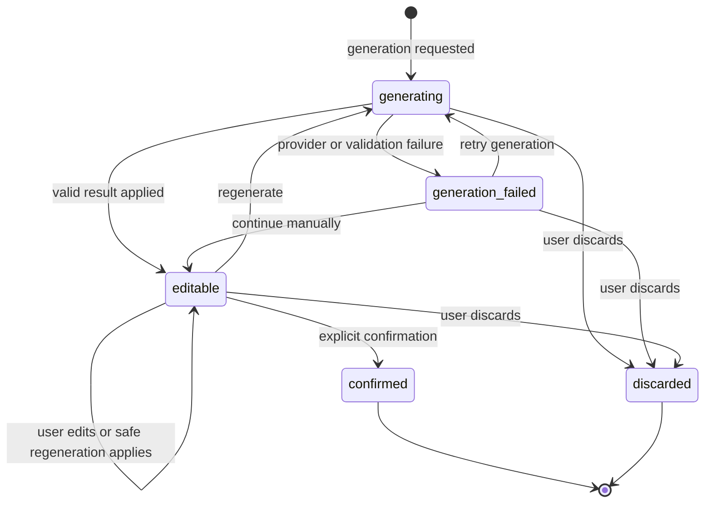

# Issue #5 Future AI Draft Lifecycle

- Date: 2026-08-29
- Status: Approved conceptual boundary; not part of the first database-backed implementation

## Required boundary

```text
generation request
→ untrusted provider result
→ backend validation
→ editable draft
→ explicit user confirmation
→ confirmed learning card
```

Provider output never directly calls card creation, chooses ownership, or modifies confirmed cards.
Drafts remain separate from cards so incomplete content cannot enter due reviews or weaken confirmed
card constraints.

## Draft states



`confirmed` and `discarded` are terminal. Confirmed-card editing uses the normal card API rather than
reopening its source draft.

## Generation runs

Provider activity is recorded separately with states `pending`, `running`, `succeeded`,
`succeeded_stale`, `failed_provider`, `failed_validation`, and `canceled`. A draft may have several
runs.

Conceptual `ai_generation_runs` fields include PostgreSQL-generated ID, owner and draft IDs,
`base_draft_version`, status, purpose, provider-neutral model identifier, validated request,
immutable raw result, redacted failure code, and timing fields.

Conceptual `card_drafts` fields include PostgreSQL-generated ID, authenticated owner, owned deck,
status/version, the same editable learning-content fields as a card, `confirmed_card_id`, and
lifecycle timestamps. Owner, languages, IDs, review state, archive state, and timestamps are never
provider- or client-selected.

## Generation request and allowlist

A future `POST /v1/ai/card-drafts` accepts an owned active `deck_id`, term, and bounded optional
context with an idempotency key. The backend derives languages, validates limits/rate policy, creates
the draft/run, calls a provider with a narrow structured schema, validates the untrusted result, and
applies it only through a version-checked update.

The provider may propose term, meaning, reading, pronunciation, romanization, target-language
definition, part-of-speech fields, notes, the single example fields, synonyms, and antonyms. It may
not choose owner, deck, language, IDs, tags, archive/review state, scheduling values, algorithm
version, SQL, tools, or external actions.

AI output follows the same required fields, language, length, reading, enum, example, and array rules
as manual content. Structural validation cannot establish factual correctness, so explicit human
review remains mandatory. Tags remain user-selected rather than an AI side effect.

## Editing and stale results

Draft PATCH uses `If-Match`; stale edits return `409 stale_draft` and never overwrite a newer version.
Every generation run records the draft version from which it started.

When a result arrives, it applies only if the owned draft is still nonterminal and its current
version equals `base_draft_version`. If the user edited, confirmed, or discarded the draft, the raw
result is retained under the run, the run becomes `succeeded_stale`, and no draft field changes.
Future UI may offer an explicit comparison, but automatic merge is outside the boundary.

Provider timeout/unavailability becomes `failed_provider`; structurally invalid output becomes
`failed_validation`. Partial content is not applied. Users may retry or continue manual authoring.
Stable external codes include `ai_provider_unavailable`, `ai_generation_timeout`,
`ai_output_invalid`, and `ai_rate_limited`; raw provider errors and credentials are not returned.

## Confirmation

A future `POST /v1/ai/card-drafts/{draft_id}/confirm` requires authentication, UUID idempotency key,
and current `If-Match` version. One transaction locks the owned editable draft, verifies the active
owned deck, revalidates all card content, creates exactly one card and its immediately due review
state, sets `confirmed_card_id`, transitions the draft to `confirmed`, and commits everything.

- Same confirmation key/body returns the original card.
- A different confirmation after success returns `409 draft_already_confirmed` with the safe owned
  card ID.
- Stale, generating, discarded, archived-deck, validation, and temporary failures use stable
  `stale_draft`, `draft_not_ready`, `draft_discarded`, `deck_archived`, validation, and retryable
  error behavior.
- Database uniqueness plus terminal state guarantees at most one confirmed card per draft under
  retry and concurrency.

## Discard, cancellation, and privacy

Draft DELETE transitions to terminal `discarded` rather than immediately erasing audit state. A
running provider cancellation is best effort. Any late result remains run evidence and cannot update
the discarded draft.

Before implementation, define retention for failed/discarded drafts and raw provider output,
personal-data handling, erasure, log redaction, and provider retention/training policy. Tokens and
provider credentials are never stored in generation records, and user corrections are not consent
to model training.

## Deliberately unresolved implementation choices

- Provider and model selection.
- Exact retention and erasure periods.
- Whether measured latency permits synchronous execution.
- Whether measured reliability later justifies a durable background job mechanism.

The lifecycle supports synchronous or asynchronous execution. No queue or worker is introduced
without measured need.

## MVP boundary

The first database-backed version retains this design boundary but does not create provider
integration, AI endpoints, queues, or workers. Manual card creation remains the implemented path.
