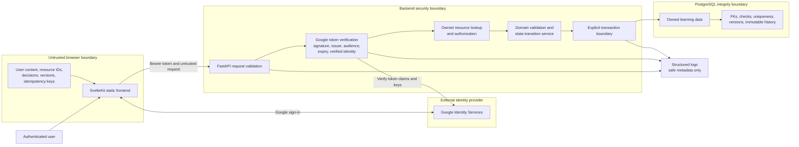
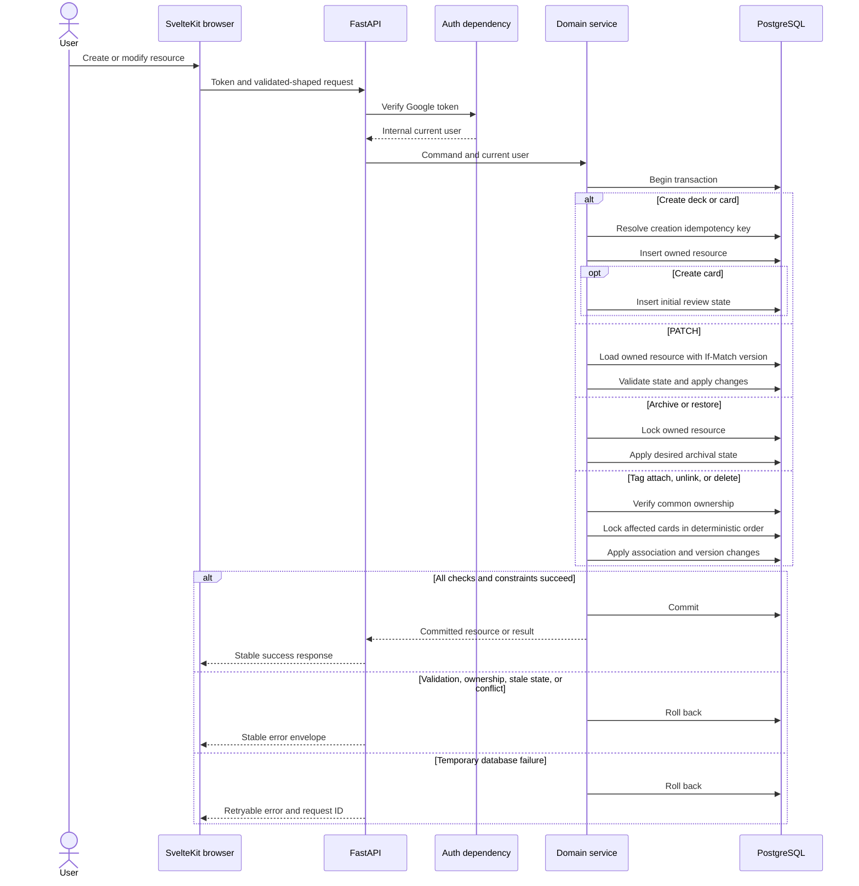
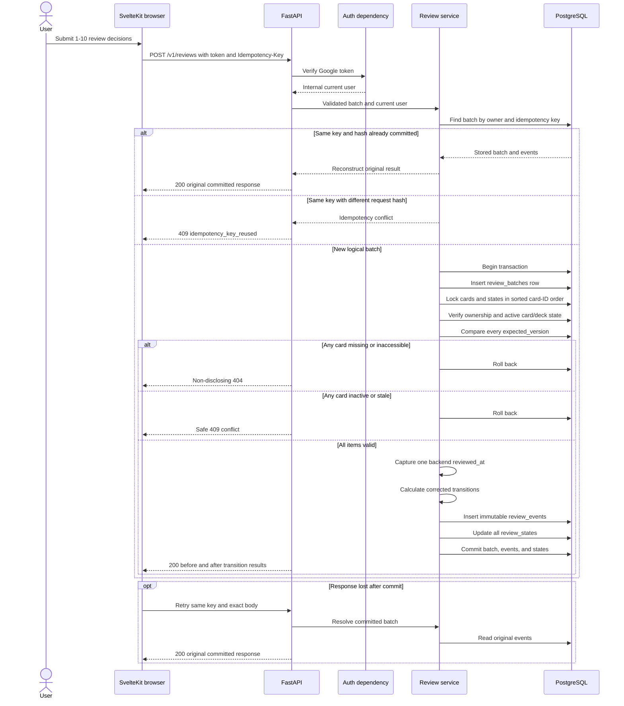

# Issue #5 Proposed Request Flows and Trust Boundaries

- Date: 2026-08-29
- Status: Approved MVP design; not implemented

## Runtime trust boundaries

Interpretation:

- Browser visibility and validation are user experience, not authorization.
- Resource IDs, content, decisions, versions, and idempotency keys are untrusted input.
- Google establishes identity; the backend separately authorizes owned resources.
- PostgreSQL constraints remain the final integrity boundary.
- Logs contain safe operational metadata rather than tokens or full private card content.

## Owned resource mutation flow

This flow makes authentication, ownership, transaction scope, constraint handling, and recovery
explicit. Card creation and initial review state are one atomic operation.

## Atomic review batch and retry flow

This flow supports the claim that a retried or concurrent review batch cannot produce partial
history, duplicate events, or silently overwrite a newer scheduling state.

## Deliberate exclusions

These diagrams do not present AI provider calls, queues, deployment infrastructure, or migration
execution as current runtime behavior. The future AI draft lifecycle receives a separate conceptual
flow after its states and failure behavior are finalized.
