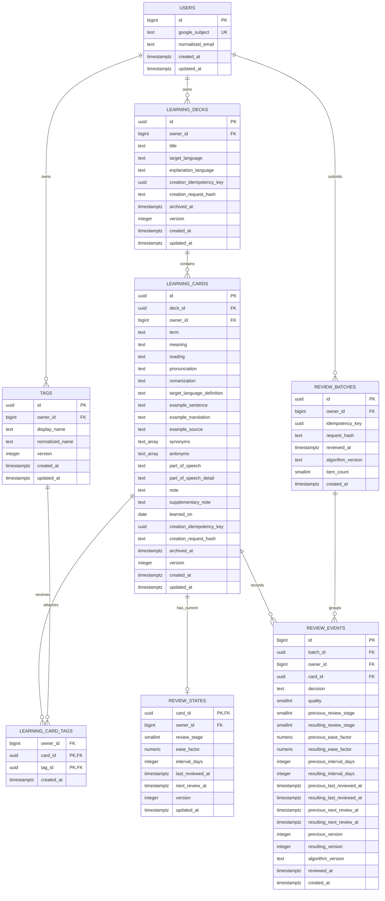

# Issue #8 Entity-Relationship Diagram

- Date: 2026-09-03
- Source of truth: Alembic revision `20260902_0002`
- Scope: Implemented persistence schema only

## Composite ownership keys

The relationship lines show entity cardinality, but these multi-column constraints carry the
ownership guarantee:

| Child columns                           | Parent columns                 | Purpose                                     |
| --------------------------------------- | ------------------------------ | ------------------------------------------- |
| `learning_cards(deck_id, owner_id)`     | `learning_decks(id, owner_id)` | A card cannot name another owner's deck     |
| `learning_card_tags(card_id, owner_id)` | `learning_cards(id, owner_id)` | The association owner must own the card     |
| `learning_card_tags(tag_id, owner_id)`  | `tags(id, owner_id)`           | The same association owner must own the tag |
| `review_states(card_id, owner_id)`      | `learning_cards(id, owner_id)` | Current state cannot cross card ownership   |
| `review_events(batch_id, owner_id)`     | `review_batches(id, owner_id)` | History cannot use another owner's batch    |
| `review_events(card_id, owner_id)`      | `learning_cards(id, owner_id)` | History cannot use another owner's card     |

The parent tables expose matching unique owned keys. The repeated `owner_id` values are deliberate:
independent foreign keys would prove only that each ID exists, not that their combination belongs to
one user.

Other uniqueness rules define durable identity and retry boundaries:

- `users.google_subject` is globally unique.
- Deck and card creation keys are unique per owner when present.
- `tags(owner_id, normalized_name)` is unique per owner.
- `review_batches(owner_id, idempotency_key)` is unique per owner.
- `review_events(batch_id, card_id)` prevents two events for one card in a batch.

## Cardinality and identity

- A user may own zero or more decks, tags, and review batches. Every one of those rows has exactly
  one owner.
- A deck may contain zero or more cards; every confirmed card belongs to exactly one deck.
- Cards and tags form a many-to-many relationship through `learning_card_tags`. Its composite
  primary key `(card_id, tag_id)` prevents duplicate attachment.
- A card may have zero or one current `review_states` row. Using `card_id` as the state primary key
  enforces that limit without an unrelated state ID.
- A batch and card may each have zero or more retained events. Unique `(batch_id, card_id)` permits
  at most one event for a card within one batch.

## Deletion behavior

All owner, deck, card, state, batch, and event relationships use restricted physical deletion so
retained learning/history identities cannot disappear underneath child rows. User-facing deck and
card deletion will archive rather than physically delete them. The sole cascade is
`tags -> learning_card_tags`: permanently deleting a tag removes only its attachment rows and never
deletes a card.

## What the diagram does not imply

- Card language is derived through its required deck; `learning_cards` intentionally has no
  duplicated language column.
- The embedded example fields are part of the card and have no separate lifecycle.
- There is no foreign key between `review_events` and `review_states`. Matching event snapshots to
  current state, updating both atomically, locking, and replay behavior belong to the future review
  transaction service.
- A batch's `item_count` and final event count are not enforceable with an ordinary row check. The
  service must establish their agreement before commit.
- Relationship lines represent implemented foreign keys. They do not claim that API authorization
  or application transactions already exist.
