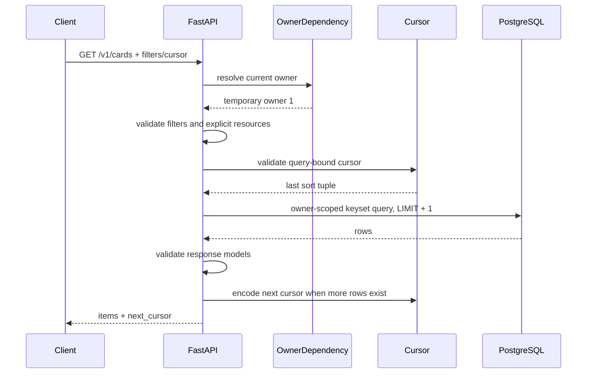

# Issue #9 實作詳解：Deterministic Multilingual Read APIs

- 日期：2026-09-04
- 狀態：已實作並通過本機驗證
- Branch：`issue-9-multilingual-read-apis`
- 核心 commit：`eac0e34 feat(api): add deterministic multilingual read APIs`
- 前置依賴：Issue #8 的 multilingual domain schema

## 1. 這張 ticket 解決什麼問題？

Issue #8 已經建立 PostgreSQL domain schema，包括：

- users；
- learning decks；
- English/Japanese 共用的 learning cards；
- tags 與 card/tag associations；
- current review states；
- review batches 與 immutable review events。

但是 Issue #8 只有 persistence layer，前端或其他 API client 還不能透過穩定的 HTTP
contract 讀取資料。Issue #9 的目標就是建立第一組正式的 read APIs，並在資料量成長前先
定義好：

1. endpoint 與 response shape；
2. deterministic ordering；
3. cursor pagination；
4. multilingual filtering；
5. ownership query boundary；
6. stable client errors；
7. database failure redaction；
8. query/index evidence。

這不是單純「把資料 SELECT 出來」。如果 list API 沒有穩定排序、cursor 沒有綁定 query
條件、ownership 沒有進 SQL，資料量與使用者增加後很容易出現重複、漏資料或 horizontal
privilege escalation。

## 2. 實作範圍

### Deck APIs

```text
GET /v1/decks
GET /v1/decks/{deck_id}
```

Deck list 支援：

- `target_language=en|ja`；
- `status=active|archived|all`，預設 `active`；
- `limit=1..100`，預設 `20`；
- opaque `cursor`。

### Card APIs

```text
GET /v1/cards
GET /v1/cards/{card_id}
```

Card list 支援：

- 一個 `deck_id`；
- `target_language=en|ja`；
- `status=active|archived|all`，預設 `active`；
- 一個 `tag_id`；
- `limit=1..100`，預設 `20`；
- opaque `cursor`。

所有 filter 使用 `AND` 組合。例如：

```http
GET /v1/cards?deck_id=<uuid>&target_language=ja&tag_id=<uuid>&status=active
```

表示「目前 owner 在這個 deck 中、語言為日文、包含指定 tag，而且 card 本身未封存」的
cards。

### Due-review API

```text
GET /v1/reviews/due
```

Due review：

- 必須提供 `target_language=en|ja`；
- 可重複提供零到二十個 `deck_id`；
- deck IDs 不可重複；
- 所有明確指定的 decks 都必須屬於目前 owner、未封存，且符合 target language；
- `limit=1..10`，預設 `10`；
- 支援帶有 server `as_of` 時間的 cursor。

若不提供 `deck_id`，代表選擇目前 owner 在指定 target language 下的所有 active decks，
不是使用一個名為「all」的特殊 deck。

## 3. 共用 multilingual contract

English 與 Japanese 沒有各自建立 endpoint、table 或 response model。語言是 deck 的
domain property，card 從 deck 取得：

- `target_language`；
- `explanation_language`。

共用 card model 保留 nullable language-specific fields，例如：

- English 可能使用 `pronunciation`；
- Japanese 可能使用 `reading` 與 `romanization`；
- 兩者都使用相同的 `term`、`meaning`、example、tags 與 review state contract。

因此 client 不需要為不同語言維護兩套 networking code。它只需要依語言決定哪些 optional
fields 要顯示。

## 4. Response models 與 list/detail 分工

`apps/api/app/reads.py` 定義下列 Pydantic response models：

- `Page[T]`；
- `Deck`；
- `DeckSummary`；
- `TagSummary`；
- `ReviewState`；
- `CardSummary`；
- `CardDetail`；
- `DueCard`。

### Collection response

所有 collection endpoints 都回傳一致的 envelope：

```json
{
  "items": [],
  "next_cursor": null
}
```

空集合是成功結果，因此回傳 `200 OK`、空 `items` 與 `next_cursor: null`，不是 `404`。

### Card summary

Card list 回傳較精簡的 `CardSummary`，包含：

- card ID；
- deck summary 與語言；
- term、meaning；
- reading、pronunciation、romanization；
- part of speech；
- archive/version/update metadata。

List 不會替每張 card 展開所有 tags、example、synonyms、antonyms 與 review details，避免
collection payload 無限制膨脹。

### Card detail

Card detail 額外回傳：

- target-language definition；
- embedded example sentence、translation、source；
- synonyms 與 antonyms；
- part-of-speech detail；
- note、supplementary note、learned date；
- 依 `lower(display_name), tag_id` 排序的 tags；
- nullable current review state。

### Due card

Due-review item 使用完整的 card representation，但將 `review_state` 收窄成 non-null。
因為沒有 review state 的 card 不可能由 due query 選出，這個 response type 把 query
guarantee 反映到 API contract。

## 5. Deterministic ordering

### 為什麼不能只用 timestamp？

`updated_at` 或 `next_review_at` 不保證唯一。兩筆資料可能在同一時間建立、更新或到期。
如果只寫：

```sql
ORDER BY updated_at DESC
```

database 可以用不同順序回傳 timestamp 相同的 rows，導致 page boundary 不穩定。

因此每一種 ordering 最後都加入唯一 ID 作 tie-breaker。

### Deck/card management order

```sql
ORDER BY updated_at DESC, id DESC
```

語意是最近更新的資料優先；若更新時間相同，再以 UUID 排出唯一順序。

下一頁使用 tuple comparison：

```sql
WHERE (updated_at, id) < (:cursor_updated_at, :cursor_id)
```

因為排序是 descending，所以 seek condition 使用 `<`。

### Due-review order

```sql
ORDER BY next_review_at ASC, card_id ASC
```

語意是最早到期、最 overdue 的 card 優先；若到期時間相同，再用 card UUID 排序。

下一頁使用：

```sql
WHERE (next_review_at, card_id) > (:cursor_due_at, :cursor_id)
```

因為排序是 ascending，所以 seek condition 使用 `>`。

## 6. 為什麼使用 keyset pagination？

常見的 page-number pagination 會使用：

```sql
LIMIT 20 OFFSET 40
```

這個方法有兩個主要問題：

1. Database 通常仍需要走過前面的 rows 才能到較大的 offset；
2. 如果前面的 rows 在兩次 request 中間新增、刪除或改變排序位置，後續 offset 可能重複
   或跳過資料。

Issue #9 改用 keyset/seek pagination。Cursor 記錄上一頁最後一筆資料的唯一 sort tuple，
下一頁直接從 tuple 後面繼續。

每個 query 都取得 `limit + 1` 筆：

```text
requested limit = 20
database fetch = 21
```

- 若只有零到二十筆，`next_cursor = null`；
- 若取得第二十一筆，response 只回前二十筆，並用第二十筆的 tuple 產生下一頁 cursor。

這樣不需要額外執行 `COUNT(*)` 或「是否還有下一頁」query。

## 7. Cursor 的內容與驗證

Cursor 由 `apps/api/app/pagination.py` 負責。

它是 versioned、URL-safe Base64 編碼的 JSON，概念上包含：

```json
{
  "v": 1,
  "kind": "cards",
  "fingerprint": "<sha256>",
  "position": {
    "updated_at": "2026-09-01T01:00:00+00:00",
    "id": "<uuid>"
  }
}
```

Due-review cursor 還包含：

```json
{
  "snapshot": {
    "as_of": "2026-09-04T10:00:00+00:00"
  }
}
```

### Query fingerprint

Fingerprint 對 normalized filters 與 effective limit 做 canonical JSON serialization，再計算
SHA-256。例如 card cursor 會綁定：

- deck ID；
- target language；
- archive status；
- tag ID；
- limit。

如果 client 在下一頁改變 filter 或 limit，server 計算出的 fingerprint 會不同，因此回傳：

```text
400 invalid_cursor
```

Cursor 也綁定 `kind`，所以 cards cursor 不能拿去讀 decks 或 due reviews。

### Strict decoding

Decoder 會驗證：

- cursor 不可為空；
- cursor 最長 2048 characters；
- Base64 必須合法；
- JSON 必須合法；
- payload 不可多欄或少欄；
- cursor version 與 endpoint kind 必須符合；
- fingerprint 必須符合目前 query；
- position/snapshot 的欄位與型別必須完全符合；
- datetime 必須包含 timezone；
- ID 必須是 UUID。

所有 decode failures 都收斂成同一個 stable error，避免 client 依賴內部 parsing 細節。

### Cursor 不是 security token

這裡的 opaque 代表「client 不應依賴內部格式」，不代表加密或不可逆。Base64 可以被解碼，
目前 cursor 也沒有 HMAC signature。Ownership 仍由 server-side owner-scoped SQL 保護，不能
依靠 cursor 保護資料。

若未來 cursor 內容包含敏感資訊，或需要防止 client 修改 position，應加入 server secret
簽章或改用 server-side cursor storage；這不在 Issue #9 的需求內。

## 8. Due-review 的 `as_of` snapshot

第一次 request 由 backend 取得 UTC server time：

```python
as_of = datetime.now(UTC)
```

Eligibility 使用：

```sql
review_states.next_review_at <= :as_of
```

後續頁面不會重新讀取目前時間，而是從 cursor 還原第一頁的 `as_of`。這避免某張 card 在
翻頁期間剛好到期，突然插入既有 traversal 的中間。

需要注意：這不是完整的 PostgreSQL MVCC snapshot。它只固定「時間到期」這個 eligibility
邊界。如果 card 的 `updated_at`、archive state 或 review state 被其他 transaction 修改，
仍可能影響後續 page。Issue #9 acceptance criterion 驗證的是 stable dataset 下不重複、不
漏資料，而不是跨多個 HTTP requests 的完整 database snapshot isolation。

## 9. Ownership 與暫時性 test-user boundary

Authentication 明確列在 Issue #9 out of scope，所以這次沒有假裝 token verification 已經
完成，也沒有讓 client 傳入 `owner_id`。

目前集中在一個 dependency：

```python
def current_owner_id() -> int:
    return TEMPORARY_TEST_OWNER_ID
```

暫時值是 fixture owner `1`。所有 SQL 都使用 dependency 提供的 owner：

```sql
WHERE owner_id = :owner_id
```

這個設計有兩個目的：

1. client 現在不能用 query/path parameter 選擇其他 owner；
2. Issue #10 可以把 dependency 換成「驗證 Google ID token，再以 Google subject 取得內部
   user」，而不需要改變 Issue #9 的 endpoint contracts。

這仍不是 production authentication。Issue #10 完成以前，這些 endpoints 不能被視為已經
具備真正的 per-user isolation。

## 10. Non-disclosing resource lookup

當 request 明確指定 deck、card 或 tag 時，query 同時檢查 ID 與 owner：

```sql
WHERE id = :id AND owner_id = :owner_id
```

不存在與屬於其他 owner 的 resource 都回傳同一類型的 `404`：

- `deck_not_found`；
- `card_not_found`；
- `tag_not_found`。

這避免 API 變成 resource-existence oracle。Client 不能根據 `403` 與 `404` 的差異猜測另一位
使用者是否擁有某個 UUID。

## 11. Filter validation

### Unknown filters

FastAPI 預設可能忽略未宣告 query parameters。Issue #9 改為明確比對 allowlist；例如：

```http
GET /v1/cards?unknown=value
```

回傳：

```text
400 unsupported_filter
```

這可以避免 client 拼錯參數卻得到看似成功、實際上未套用 filter 的資料。

### Language、status、limit 與 UUID

Boundary 使用 typed FastAPI/Pydantic validation：

- target language 只接受 `en` 或 `ja`；
- status 只接受 `active`、`archived` 或 `all`；
- management limit 為 1–100；
- due limit 為 1–10；
- resource IDs 必須是 UUID。

這些錯誤進入既有 `422 validation_failed` envelope，不會回傳 rejected raw input。

### Due deck scope

Due-review 對明確 decks 做額外 domain validation：

- 超過二十個：`422 validation_failed / too_many_items`；
- 重複 ID：`422 validation_failed / duplicate`；
- missing 或 cross-owner：`404 deck_not_found`；
- 語言不符：`422 validation_failed / invalid_choice`；
- deck archived：`409 review_scope_inactive`。

## 12. Database read flow

一般 request flow 如下：



`database_session()` 每次 request 建立一個短生命週期 SQLAlchemy session，最後一定 close。
Read query 不需要 commit；session close 會釋放 connection/transaction resources。

## 13. Database failure handling

如果 SQLAlchemy 在 query 過程中發生 database exception，dependency 會轉換成：

```json
{
  "error": {
    "code": "database_unavailable",
    "message": "The database is temporarily unavailable.",
    "retryable": true,
    "request_id": "<server-generated-uuid>"
  }
}
```

HTTP status 是 `503 Service Unavailable`。Response 不包含：

- SQL statement；
- schema/table names；
- driver exception；
- hostname；
- username/password；
- database URL。

這沿用 Issue #7 的共同 error envelope，讓 frontend 可以依穩定的 machine-readable `code`
決定 retry UI，而不是解析人類可讀 message。

## 14. SQL 與 aggregation

Card detail 使用 PostgreSQL `jsonb_build_object` 組出：

- deck summary；
- review state；
- ordered tag summaries。

Tags 使用 correlated subquery 與 `jsonb_agg`，並將沒有 tags 的結果轉成空 JSON array：

```sql
COALESCE(..., '[]'::jsonb)
```

因此 API contract 回傳 `tags: []`，不會因為 SQL aggregate 的 `NULL` 而變成 `tags: null`。

Tag filter 則使用 `EXISTS`，避免為了過濾 card 而讓 main result 產生 duplicate rows：

```sql
EXISTS (
    SELECT 1
    FROM learning_card_tags
    WHERE card_id = learning_cards.id
      AND owner_id = learning_cards.owner_id
      AND tag_id = :tag_id
)
```

## 15. Migration 與 indexes

新增 Alembic revision：

```text
20260903_0003_add_read_api_indexes.py
```

新增兩個 index：

```text
ix_learning_decks_owner_updated_id
    (owner_id, updated_at DESC, id DESC)

ix_learning_cards_owner_updated_id
    (owner_id, updated_at DESC, id DESC)
```

它們對應 management list 的 owner filter 與 deterministic order。Due review 與 tag filter
沿用 Issue #8 已建立的：

```text
ix_review_states_owner_next_review_card
ix_learning_card_tags_tag_id_card_id
```

Migration 的 `downgrade()` 只移除這兩個新 index，不修改 domain data。

## 16. `EXPLAIN` 驗證

Planner integration test 建立 deterministic representative dataset：

- 100 owners；
- 2,000 decks；
- 40,000 cards；
- 40,000 review states；
- 40,000 card/tag links；
- 40,000 review events；
- 4,000 review batches。

Test 先執行 `ANALYZE`，再對九個 access patterns 執行：

```sql
EXPLAIN (ANALYZE, BUFFERS, FORMAT JSON)
```

Issue #9 主要確認：

| Access pattern | PostgreSQL 選擇的 index |
| --- | --- |
| Owner deck management list | `ix_learning_decks_owner_updated_id` |
| Owner card management list | `ix_learning_cards_owner_updated_id` |
| Card tag reverse traversal | `ix_learning_card_tags_tag_id_card_id` |
| Owner due-review retrieval | `ix_review_states_owner_next_review_card` |

測試沒有關閉 sequential scan，也沒有強制 planner 使用 index。

這項證據只能說明「PostgreSQL 17 在這個 deterministic local distribution 下自然選擇了
設計的 index」，不能宣稱 production latency、throughput 或未來所有資料分布都會使用同一
plan。測試也刻意不鎖定 cost、timing、buffer count 或完整 plan tree，避免 PostgreSQL
minor version 與機器差異造成脆弱測試。

## 17. 測試覆蓋

### Positive paths

- English deck/card list and detail；
- Japanese deck/card list and detail；
- 同一組 fields 與 endpoints 支援兩種語言；
- target-language filtering；
- tag filtering；
- due-review retrieval；
- complete card content、tags 與 review state。

### Empty paths

- 沒有 archived decks 時回傳空 collection；
- 沒有 archived cards 時回傳空 collection；
- empty result 是 `200`，不是 error。

### Pagination paths

- 相同 timestamps 使用 UUID tie-breaker；
- card pages 逐頁取得所有 IDs；
- due-review pages 依 due time 排序；
- 測試結果沒有 duplicate 或 skipped IDs；
- 最後一頁的 `next_cursor` 是 `null`；
- 改變 filter 後重用 cursor 會被拒絕。

### Invalid-input paths

- malformed Base64 cursor；
- oversized cursor；
- cursor/query fingerprint 不符；
- unsupported query parameter；
- unsupported language；
- duplicate due deck IDs；
- due deck language mismatch。

### Resource/failure paths

- missing deck detail；
- missing card detail；
- wrong-language due deck scope；
- forced SQLAlchemy `OperationalError`；
- database exception、SQL 與 connection secret 不會出現在 response。

### Migration與 planner paths

- clean database upgrade；
- downgrade to baseline；
- re-upgrade to head；
- head revision 更新為 `20260903_0003`；
- representative plans 選擇預期 index。

## 18. 最終驗證結果

執行：

```bash
uv run ruff format --check .
uv run ruff check .
RUN_POSTGRES_INTEGRATION_TESTS=1 uv run pytest -q
uv lock --check
git diff --check
```

結果：

- 122 tests passed against local PostgreSQL 17；
- full pytest suite：45.82 seconds；
- Ruff formatting passed；
- Ruff lint passed；
- uv lock check passed；
- whitespace check passed；
- 保留一個既有的 upstream FastAPI `TestClient` deprecation warning。

這些是 local correctness 與 planner-selection evidence，不是 remote CI、production
availability、endpoint latency 或 user-impact evidence。

## 19. 重要修正

最初 cursor query parameter 直接使用 FastAPI 的 `max_length=2048`。這會讓 oversized cursor
在進入 cursor decoder 前被 FastAPI 攔截，回傳 generic `422 validation_failed`，與已定義的
`400 invalid_cursor` contract 不一致。

最後將長度驗證移到 `decode_cursor()`：

```python
if not cursor or len(cursor) > MAX_CURSOR_LENGTH:
    raise ValueError
```

如此 malformed、oversized、wrong-shape、wrong-filter 等 cursor failures 都會穩定收斂成：

```text
400 invalid_cursor
```

這個修正的重點不是格式，而是確保 transport validation 與 application error contract 沒有
互相衝突。

## 20. 明確未實作的內容

### Authentication

目前 owner `1` 是 temporary boundary，不是 Google token verification。Issue #10 必須驗證：

- token signature；
- issuer；
- audience；
- expiry；
- email verification；
- Google subject 到 internal user 的 mapping。

### Write endpoints

這張 ticket 沒有實作 deck/card create、update、archive，也沒有 review submission、locking、
idempotency replay 或 atomic state transition。

### Frontend integration

現有 SvelteKit frontend 仍然走 Google Apps Script 與 Google Sheets。Issue #9 沒有改變目前
使用者的 review flow，也沒有宣稱 PostgreSQL 已經成為 runtime source of truth。

### Search

Issue #5 曾設計一般 substring `query` filter，但 Issue #9 只要求 target-language 與 tag
filtering，而 search infrastructure 又明確 out of scope，因此本次沒有加入 `query` filter。
未來應先定義 normalization contract 與實際需求，再決定是否需要 trigram、full-text index
或其他方案。

### Full cross-request snapshot

Keyset pagination 在測試的 stable dataset 中不重複、不漏資料。它不承諾多個 HTTP requests
期間資料完全不變，也沒有建立 persisted review session 或 reservation。

## 21. File-by-file change map

| File | 目的 |
| --- | --- |
| `apps/api/app/reads.py` | Routes、response models、owner dependency、filters、SQL、error translation |
| `apps/api/app/pagination.py` | Cursor encoding、fingerprint、strict decoding、typed position parsing |
| `apps/api/app/main.py` | 將 `/v1` read router 加入 FastAPI application |
| `apps/api/migrations/versions/20260903_0003_add_read_api_indexes.py` | 新增可逆 management-list indexes |
| `apps/api/tests/integration/test_read_apis.py` | Real PostgreSQL HTTP contracts 與 pagination/failure tests |
| `apps/api/tests/unit/test_reads.py` | Forced database failure redaction test |
| `apps/api/tests/integration/test_migrations.py` | 將 Alembic head 驗證更新到 revision 0003 |
| `apps/api/tests/integration/test_query_plans.py` | 新增 deck/card management plan assertions |
| `apps/api/README.md` | Read endpoints、migration 與 verification instructions |
| `doc/architecture.md` | Backend read data flow 與 source ownership |
| `doc/decisions.md` | Cursor、owner boundary 的 durable decisions |
| `doc/project-memory.md` | Product/backend current state |
| `doc/training/project-memory.md` | Active milestone 與下一步 |
| `doc/training/logs/2026-W36.md` | 實作、修正、驗證與限制紀錄 |
| `doc/training/evidence.md` | 僅記錄已實作、已驗證的工程證據 |
| `doc/training/issues/issue-9/` | Contract、examples、query plans 與本詳解 |

## 22. 如何向 reviewer 解釋這個設計？

可以使用以下版本：

> Issue #9 把 Issue #8 的 multilingual PostgreSQL schema 暴露成第一組穩定 read APIs。
> English 和 Japanese 共用 route 與 model；deck/card management 使用
> `(updated_at, id)` descending keyset，due review 使用 `(next_review_at, card_id)` ascending
> keyset。每個 cursor 都綁定 endpoint、normalized filters、limit 與 position，而 due cursor
> 還固定第一頁的 server `as_of`，避免只因時間前進就有新 card 插入 traversal。所有 SQL 都
> owner-scoped，missing 與 cross-owner resource 使用相同 404；authentication 暫時集中在一個
> owner dependency，下一張 ticket 可以替換成 Google token verification 而不改 API contract。
> Database failures 經共同 error envelope 轉成安全且可重試的 503。最後用 real PostgreSQL
> HTTP tests 驗證 pagination、filter、empty/not-found/failure paths，並以 EXPLAIN 驗證主要
> access patterns 的 index selection。

## 23. Reviewer 可能追問的問題

### 為什麼 cursor 需要 UUID tie-breaker？

Timestamp 不唯一。沒有唯一 tie-breaker 時，database 對同 timestamp rows 的相對順序沒有
保證，page boundary 可能不穩定。

### 為什麼 cursor 要綁 filter 與 limit？

Cursor position 只對產生它的 query shape 有意義。改變 filter 或 limit 後繼續使用同一個
position，容易造成難以理解的 missing/duplicate results。

### 為什麼不用 OFFSET？

Keyset 能直接 seek 到最後 sort tuple，且較不容易因前方 insert/delete 而移動 page
boundary。Acceptance criterion 也明確要求 stable dataset 不重複、不漏資料。

### `as_of` 是否代表完整 snapshot？

不是。它只固定 due-time eligibility。其他 concurrent mutations 仍可能改變後續頁面。

### 為什麼 cross-owner resource 回 404 而不是 403？

因為 client 不應知道另一位使用者是否擁有該 UUID。相同 404 可以降低 resource enumeration
與 existence disclosure。

### 為什麼不是現在就做 authentication？

Issue #9 的 out-of-scope 明確排除 authentication。這次保留一個可替換 dependency，先驗證
read contracts；Issue #10 再建立真正的 Google token verification 與 user mapping。

### `EXPLAIN` 通過是否代表 API 很快？

不代表。它只證明在本機 representative distribution 下，PostgreSQL 選擇了預期 index。
沒有 production latency、throughput 或真實資料分布證據。

## 24. Acceptance criteria 對照

| Acceptance criterion | 完成方式 |
| --- | --- |
| Results have deterministic ordering | 每個 list order 最後都有唯一 UUID tie-breaker |
| Cursor pagination does not duplicate or skip records | Card 與 due multi-page integration tests 驗證全部 IDs 恰好一次 |
| English and Japanese use the same endpoint contracts | 共用 routes、Pydantic models、SQL 與 bilingual tests |
| Invalid cursors and filters return stable client errors | 覆蓋 malformed、oversized、wrong-shape、unknown、invalid-language 等 cases |
| Internal database failures are not exposed | Forced SQLAlchemy failure 僅回 safe retryable 503 |
| Query plans are recorded | PostgreSQL 17 JSON EXPLAIN test 與 query-plan report |
| API examples and relevant tests are checked in | `api-examples.md` 與 unit/integration tests |

## 25. 下一步

Issue #10 應把：

```text
temporary owner dependency
```

替換為：

```text
Authorization: Bearer <Google ID token>
    -> verify signature/issuer/audience/expiry/email_verified
    -> obtain Google subject
    -> map subject to internal users.id
    -> inject authenticated current user/owner
    -> execute the same owner-scoped Issue #9 queries
```

重點是保留已驗證的 endpoint、filter、pagination 與 response contracts，只替換 identity
resolution boundary。
